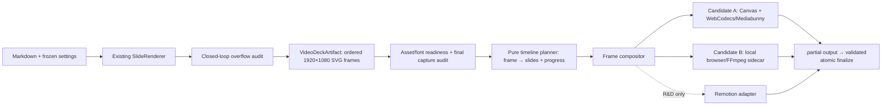

# R-005 — Deterministic 슬라이드→MP4 내보내기 및 Remotion 연계 타당성

## Executive summary

- **최종 판정:** “Achmage Slides Ultra가 이미 어려운 디자인·파싱·레이아웃·오버플로 보정을 결정론적으로 해결했으므로, AI 토큰 없이 MP4를 만드는 시각·시간축 코어는 생각보다 쉽다”는 가설은 **방향상 맞다**. 현재 소스는 Markdown과 설정에서 ordered physical slide SVG를 만들고, 그 순서는 이미 `2-1 → 2-2 → 2-3 → 3-1 …`의 영상 읽기 순서다. 별도의 AI 판단이나 Markdown 재파싱 없이 `고정된 프레임 + 시간축 정책 + 인코더`를 붙일 수 있다.
- **중요한 교정:** 이것은 “현재 HTML에 Remotion 버튼 한 줄을 붙이면 제품이 완성된다”는 뜻은 아니다. 남은 일은 창작 문제가 아니라 **렌더 경계의 제품 엔지니어링**이다. 프레임별 시간 계약, CSS가 아니라 frame-index로 구동되는 전환, 폰트·이미지 readiness, SVG/DOM의 픽셀 보존 캡처, codec capability, 장시간 작업의 진행·취소·임시파일, 플랫폼 배포와 라이선스가 필요하다.
- **MVP 타당성:** 최종 overflow audit를 통과한 물리 슬라이드를 정적 프레임으로 고정하고, 섹션 내 이동은 수직 전환·섹션 경계는 수평 전환 또는 crossfade, 전역 고정 hold, 무음 1920×1080 영상으로 내보내는 기능 자체는 **기술 타당성 높음**이다. 다만 “별도 설치 없는 in-plugin H.264 MP4” 구현 경로까지 확정된 것은 아니다. 객체별 등장 애니메이션은 그 위에 selector→motion 문법을 추가하는 중간 난도이며, 자동 내레이션·임의 동영상 embed·음성 길이 동기화는 별도 연구 범위다.
- **실험으로 확인된 경계:** 실제 English demo의 title/card/image 3개 Marp SVG를 Chrome 150에서 canvas로 옮긴 bounded spike에서, 모든 CSS·font·image를 inline한 data-URI 경로는 origin-clean canvas·`VideoFrame`·VP9 1-frame encode까지 성공했고 레이아웃·배경·이미지 누락도 없었다. canonical screenshot 대비 RGB channel 차이 `>10`인 pixel 비율은 각각 0%, 1.1065%, 0.0942%였다. 반면 Blob URL은 `foreignObject` 때문에 canvas가 taint됐고 `createImageBitmap(svgBlob)`은 decode에 실패했다. 같은 headless 조건에서 H.264는 unsupported, VP9은 supported였다. 즉 기존 SVG를 React로 재구현하지 않는 pixel bridge는 유망하다고 실증했지만, full corpus와 actual Obsidian/H.264 gate는 아직 남았다.
- **Remotion 판정:** Remotion의 frame model과 렌더 API는 이 문제에 잘 맞지만, **공개 Obsidian Community 플러그인의 기본 production dependency로는 현재 권고하지 않는다.** `@remotion/web-renderer`는 기존 HTML을 일반적으로 픽셀 screenshot하지 않고 제한된 DOM→Canvas 재구성을 사용하며, full HTML capture는 Chromium 152+의 실험 flag가 필요하다. 더 결정적으로 Web Renderer는 매 렌더마다 IP·origin 등을 외부로 보내는 텔레메트리를 강제하고, Obsidian 정책은 client-side telemetry를 금지한다.
- **라이선스 판정:** Remotion은 OSI 오픈소스가 아닌 source-available 소프트웨어다. 개인·3인 이하 영리 조직·비영리 등만 Free License 대상이며, 공식 FAQ는 `renderMedia()`, `renderMediaOnWeb()`, CLI render 및 `<Player>` 호출을 Automation으로 분류한다. 불특정 최종사용자에게 배포하는 Community 플러그인에서 누가 licensee인지 Remotion의 서면 확인 없이는 production release gate를 통과시켜서는 안 된다.
- **권장 아키텍처:** Remotion에 종속되지 않는 `VideoDeckArtifact`를 최종 audited renderer에서 만들고, 순수 함수 `frame → {currentSlide, nextSlide, progress}`로 timeline을 계산한다. 1차 **사전 PoC 후보**는 기존 SVG/Canvas + WebCodecs/Mediabunny 직접 인코딩, fidelity·codec gate 실패 시 **격리된 local browser/encoder sidecar**다. Remotion은 R&D 비교 기준 또는 사용자가 별도 설치·라이선스하는 선택적 sidecar로 남긴다. Markdown→React 재구현은 기존의 가장 가치 있는 결정론적 엔진을 복제하므로 기각한다.
- **Scorecard·성능 영향:** 현재 `main.js`는 이미 5,254,896 bytes이고 R-003은 크기·capability warning을 줄이는 중이다. 격리된 minified browser bundle 실험에서 muted `@remotion/web-renderer` 경로는 2,356,230 bytes, direct Mediabunny 경로는 169,634 bytes였다. 전자는 단순 합산만으로 7,611,126 bytes가 되고, 후자도 5,424,530 bytes라 R-003의 조건부 4.9MB 목표를 넘는다. 이는 최종 통합 bundle 수치가 아니지만 Remotion/React/encoder를 main에 직접 넣으면 size, network, dependency, filesystem/child-process, loading 연구 R-003·R-004와 충돌한다는 실측 근거다.
- **로컬 스킬 처리:** 요청한 Achmage OS 원본은 읽기 전용으로만 조사했고 수정하지 않았다. `20_Master-Skills` 아래 독립 `remotion/SKILL.md`는 발견되지 않았으며, Remotion을 기술한 유일한 skill은 `consulting-chart/SKILL.md`였다. 이 문서는 React+Remotion을 표방하지만 포함된 실행 예제는 CSS animation HTML을 Chrome virtual time으로 PNG 캡처한 뒤 FFmpeg로 인코딩하는 방식이다. 따라서 아이디어와 timing 규칙은 근거가 되지만 재사용 가능한 Remotion 구현체로 간주할 수 없다.
- **2026-08-04 구현 결정:** 첫 제품 범위는 `MP4 only`, 무음, 1920×1080/30fps, 전역 slide 표시시간 직접 입력, section 내부 수직·section 경계 수평의 Smart 전환으로 고정한다. Remotion 4.0.505는 source-available/Automation license와 client render telemetry가 그대로여서 runtime dependency에서 제외하고, exact `mediabunny@1.52.3`의 MPL-2.0 MP4/WebCodecs 경로만 qualification한다.
- **지원 환경 결정:** 앱 표시 버전만으로 codec을 가정하지 않는다. 현재 owner 환경은 Obsidian app payload 1.13.4이지만 installer 1.9.12, Electron 37.3.1, Chromium 138.0.7204.235다. 이 환경과 최신 Windows installer, 최신 macOS arm64 official Obsidian에서 실제 2초 H.264 encode→mux→decode가 모두 성공해야 출시한다. 하나라도 실패하면 WebM·외부 FFmpeg·Remotion으로 자동 fallback하지 않고 1.2.0 제품 구현/출시를 중단한다.

## Research brief

### 배경과 의사결정

사용자가 받은 개발자 의견은 다음 두 종류의 난도를 구분한다.

1. **창작·설계 난도:** dark/light, brutalist 여부, 카드·슬라이드 수, 폰트 크기, 정보 계층과 화면 밀도를 정하는 열린 문제.
2. **렌더·인코딩 난도:** 이미 확정된 장면을 frame index에 따라 계산하고 이미지로 캡처한 뒤 MP4로 묶는 닫힌 문제.

일반적인 agent-generated video에서는 1번이 토큰과 반복을 많이 소비한다. Achmage는 이미 설정, 테마, Pretext 측정, overflow split, closed-loop audit로 1번의 큰 부분을 결정론적 규칙으로 고정했다. 이 보고서는 그 사실이 MP4 내보내기를 실제로 얼마나 단순화하는지, 그리고 Remotion을 직접 넣는 것이 Community 플러그인 제품화에도 최선인지를 결정한다.

### 핵심 질문

1. 기존 Markdown→SlideMap→Marp SVG→audited HTML pipeline이 영상 입력으로 충분히 안정된 단일 진실원천인가?
2. 2차원 논리 슬라이드/세로 frame 구조를 AI 없이 1차원 영상 timeline으로 만들 수 있는가?
3. Remotion의 렌더 과정은 실제로 frame-driven·deterministic한가, CSS/wall-clock animation과 무엇이 다른가?
4. 기존 Achmage HTML/SVG를 React 슬라이드로 다시 만들지 않고 Remotion에 연결할 수 있는가?
5. `@remotion/web-renderer`, server renderer, sidecar, Chrome+FFmpeg, MediaRecorder, WebCodecs/Mediabunny 중 어떤 경로가 fidelity·배포·라이선스·Scorecard에 적합한가?
6. Dropbox의 `consulting-chart`와 `component-consulting` skill은 이 결정에 어떤 설계 규칙과 구현 근거를 제공하는가?
7. “AI 토큰 0”과 “개발 난도 낮음”, “같은 입력이면 같은 영상”을 어떤 수준으로 구분해야 하는가?
8. 첫 릴리스에 포함할 최소 범위와 별도 R-ID로 분리할 범위는 무엇인가?

### 반증 질문

1. 기존 exported HTML을 frame별로 screenshot하는 과정에서 font, foreignObject, background image, MathJax, code highlight 또는 plugin-host CSS가 달라지는가?
2. 기존 0.3초 CSS transition을 그대로 녹화하면 병렬·비순차 frame rendering에서 flicker 또는 상태 의존이 생기는가?
3. Obsidian의 실제 Electron runtime이 H.264 WebCodecs encoding을 지원하지 않거나 장문 deck에서 UI를 장시간 막는가?
4. Remotion의 라이선스·텔레메트리·binary 배포가 Community 정책 또는 사용자 신뢰와 충돌해 기술적 이득을 상쇄하는가?
5. Remotion 없이 WebCodecs/Mediabunny를 직접 쓰는 편이 동일한 MVP를 더 작고 투명하게 만드는가?

### 성공 기준

이 보고서는 다음을 모두 만족할 때 `complete`로 본다.

- 저장소의 canonical slide artifact와 video seam을 `path:line` 단위로 특정한다.
- “쉬워진 부분”과 “여전히 어려운 부분”을 AI/token, visual fidelity, product delivery로 분리한다.
- Remotion 4.0.504의 Web/Server/Electron 렌더 경로, 결정론, package/runtime, 라이선스, 텔레메트리를 공식 원문으로 검증한다.
- 로컬 두 skill의 실제 파일과 예제를 대조하고 주장과 구현의 차이를 기록한다.
- 최소 6개 이상의 대안을 제품·보안·성능·호환성·배포 기준으로 비교한다.
- 계획 담당자가 바로 쓸 수 있는 architecture contract, 권고와 반증 가능한 acceptance criteria를 제공한다.
- 원본 Achmage OS skill 파일을 수정하지 않았음을 시작·종료 hash로 확인한다.

## Scope

### 포함

- silent MP4를 중심으로 한 deterministic slide-video export feasibility
- 기존 logical group/physical frame의 canonical reading order
- static hold, slide-level transition, 향후 selector-based component motion
- Remotion Web Renderer, server renderer, Electron/sidecar 경로
- browser-native WebCodecs/Mediabunny와 Chrome/FFmpeg 대안
- 폰트·이미지·background·embedded asset readiness와 offline export
- progress, cancellation, output atomicity, temp cleanup, codec probing
- Remotion/FFmpeg/Mediabunny license와 Obsidian Community 정책
- R-003 Scorecard와 R-004 performance 연구에 미치는 영향

### 제외

- 이번 조사에서 실제 `Export as MP4` 구현, package 설치, branch, version bump, release
- 자동 TTS/AI voice, 자막 생성, 음악 추천, beat synchronization
- 임의 embedded video의 정확한 seek/decode/mix
- 사용자별 장면 편집기·timeline editor
- cloud/Lambda 렌더 서비스 운영
- cross-platform raw MP4 byte-identical 보장
- Remotion 측 법률 의견을 대신하는 최종 법률 판단

## Baseline and method

- **기준 커밋:** `b061ce8c4aa528cb6b909f64a87a78a342b2f1d9` (`main`).
- **저장소 환경:** Windows x64, Node `v24.12.0`, package `1.0.3`, desktop-only, minimum Obsidian `1.7.2`.
- **외부 조사 기준:** 2026-08-03. Remotion `4.0.504`는 npm에 2026-08-02 게시됐고 관련 공식 문서도 2026-08-01~02 갱신된 매우 변동성 높은 표면이다.
- **현재 로컬 브라우저 관찰:** 설치된 Google Chrome은 `150.0.7871.187`; 이는 Obsidian Electron의 Chromium 버전을 뜻하지 않는다. Remotion 4.0.504 server가 pin한 Chrome 149와 함께, Chromium 152+ 실험 capture 조건을 현재 기본값으로 가정할 수 없다는 보조 관찰에만 사용했다.
- **방법:** source/line audit, committed HTML export topology count, package/repo search, npm registry metadata, Remotion/Obsidian/Mediabunny 공식 문서, 로컬 skill 전문과 실행 예제 비교, 대안·위협 모델 분석, isolated browser-bundle 실험, 실제 committed SVG 3종의 Chrome raster/codec bounded spike.
- **재현 명령 요약:** `git rev-parse HEAD`; `rg` symbol/provenance search; `npm view remotion @remotion/renderer @remotion/bundler @remotion/web-renderer ...`; GitHub release API; committed `examples/*.slides.html`의 group/frame/SVG/viewBox regex count; Chrome/FFmpeg availability check; skill file SHA-256; isolated esbuild browser/minify bundle; Chrome `--headless=new --disable-gpu`에서 serialized SVG의 Blob/data-URI decode, canvas readback, `VideoFrame`, `VideoEncoder.isConfigSupported()`와 1-frame encode.
- **제품 파일 변경:** 없음. 본 보고서와 자동 생성 Register 외에 ignored `build/research/r005-svg-canvas-spike/`에 재현 보조 산출물을 생성했다. plugin runtime/source/package에는 손대지 않았다.
- **방법의 한계:** actual Obsidian renderer가 아니라 설치된 Chrome 150 headless에서 3개 English slide만 실험했다. 전체 Korean/theme/layout corpus pixel parity와 실제 Obsidian의 H.264 capability, integrated production bundle delta, Remotion Community-plugin license ownership은 각각 후속 PoC와 서면 확인이 필요하다.

### 2026-08-04 release-planning refresh

- **새 기준 커밋:** `b28c160850f24873635e62aed5e7f0ba0da549a2`, package/manifest `1.1.4`. 이 branch의 제품·배포 tree는 annotated `1.1.4`가 가리키는 merge commit `85064808194da99c9416f477968cae15c4061297`과 일치한다.
- **저장소 상태:** `main.js`는 UTF-8 build와 1.1.3 Scorecard refactor, 1.1.4 navigation polish를 포함한다. Community review는 Satisfactory 3/4이며 declarative settings, direct filesystem, clipboard, dynamic code execution이 공개 residual이다.
- **변동 정보 갱신:** Remotion 4.0.505, Mediabunny 1.52.3, Obsidian public latest 1.13.4를 공식 원문/registry에서 재확인했다.
- **qualification 환경:** owner Windows의 running app/installer/engine을 read-only로 확인했다. 제품 코드는 아직 수정하지 않았으며 H.264 actual-host probe는 승인된 P-007/E-007의 첫 구현 tranche로 남긴다.

## Claim decomposition — 무엇이 맞고 무엇이 과장인가

| 명제 | 판정 | 근거와 교정 |
|---|---|---|
| 일반 agent-video에서 theme/layout/count/type 선택이 큰 판단 비용이다 | 대체로 맞음 | 로컬 skill도 video type, data, size, output을 먼저 확정하고 component skill은 message/token/job-slot 결정을 구현보다 앞세운다. 이는 Moravec의 역설의 엄밀한 실증이라기보다 열린 설계 문제와 닫힌 렌더 문제의 엔지니어링 비대칭이다. |
| Achmage는 그 열린 설계 문제의 큰 부분을 이미 결정론적으로 고정했다 | 맞음 | settings→typography→shape templates→overflow split→Marp→closed-loop audit가 하나의 pipeline이고 physical SVG가 이미 생성된다. |
| 영상 frame 계산과 MP4 encoding은 AI 없이 가능하다 | 맞음 | 고정 artifact, fps, hold, transition, seed가 있으면 frame state는 순수 함수다. Remotion도 `useCurrentFrame()`과 composition metadata를 중심으로 동작한다. |
| 기존 2D slide map을 영상용으로 다시 이해해야 한다 | 틀림 | physical slide 배열이 이미 logical group 안의 frame을 순서대로 append하므로 영상 reading order가 존재한다. |
| 현재 HTML에 Remotion 버튼만 추가하면 끝이다 | 과장 | canonical timeline, frame-addressable motion, asset readiness, capture fidelity, encoder capability, job lifecycle, distribution/license가 없다. |
| Remotion을 반드시 써야 한다 | 틀림 | static slide image + transition + MP4에는 WebCodecs/Mediabunny 또는 frame sequence+FFmpeg도 충분하다. Remotion의 고유 이득은 richer React timeline/composition과 render orchestration이다. |
| AI 토큰 0이면 같은 입력에서 언제나 byte-identical MP4다 | 틀림 | 논리 frame 결정론, 픽셀 결정론, encoded output 결정론은 서로 다르다. 브라우저·font·GPU encoder·container metadata를 pin하지 않으면 raw file hash는 달라질 수 있다. |

## Current-state evidence

### 1. 이미 존재하는 결정론적 visual pipeline

`SlideRenderer.render()`는 한 번의 동기 pipeline 안에서 다음을 수행한다.

```text
Markdown
  → Obsidian syntax conversion
  → frontmatter/settings injection
  → title + exact typography
  → deterministic Tier-2 shape templates
  → Pretext-based overflow split + SlideMap
  → Marp per-physical-slide SVG
  → native decoration
  → presentation HTML
```

- `src/engine/slideRenderer.ts:91-140`이 위 흐름의 단일 진실원천이다.
- `src/preprocessor/shapeTemplates.ts:1-18,55-97,314-408,1481-1526`은 구조 signature와 deterministic routing을 사용하며 runtime AI scoring을 하지 않는다.
- `src/preprocessor/overflowSplitter.ts:18-37,115-199,887-950`의 `SlideMapEntry`와 append 순서는 logical slide와 그 physical frames를 안정적으로 연결한다.
- `src/engine/marpEngine.ts:14-20,49-55`는 physical slide마다 SVG string을, deck 공용 CSS와 comments를 반환한다.
- `src/engine/slideRenderer.ts:168-220`은 그 배열을 contiguous logical group으로 묶는다.
- live preview와 HTML export는 같은 closed-loop audit를 공유한다(`src/audit/auditLoop.ts:1-11,55-95,151-180`; `src/view/slidePreviewView.ts:303-367,374-403`; `src/main.ts:299-324`).

따라서 영상 export가 다시 해결할 대상은 Markdown layout이 아니라 **최종 audited visual artifact를 시간축에 올리는 일**이다.

### 2. committed export topology 실험

두 self-contained example export를 regex로 계수했다.

| 파일 | bytes | logical groups | physical frames | Marp SVG | `viewBox="0 0 1920 1080"` |
|---|---:|---:|---:|---:|---:|
| English demo | 3,936,919 | 43 | 47 | 47 | 47/47 |
| Korean demo | 3,940,983 | 42 | 46 | 46 | 46/46 |

관찰상 물리 SVG는 이미 네이티브 1920×1080이고, logical group 수보다 physical frame이 많아 vertical overflow split도 artifact에 보존된다. 영상은 navigation click을 모사할 필요 없이 이 physical array를 한 번씩 순회하면 된다.

### 3. 현재 temporal/video subsystem의 부재

- `RenderedDeck`은 현재 `html`과 `slideCount`만 노출한다(`src/engine/slideRenderer.ts:37-40`). ordered physical SVG, slideMap, comments, settings/source hash를 외부 export service가 받을 typed contract가 없다.
- 기존 shell의 visible motion은 `.achmage-frame-stack`과 logical group에 hard-coded된 wall-clock CSS 0.3초 transition/animation이다(`src/engine/slideRenderer.ts:272-310,425-464`). IIFE navigation은 `setTimeout`을 사용하고 현재 group/frame getter만 외부에 노출한다(`:643-684`). 이는 frame N을 독립적으로 계산하는 video contract가 아니다.
- settings에는 `none/fade/slide/reveal/zoom/wipe`가 있으나 frontmatter injection용이며 presentation shell은 그 값을 canonical video transition으로 소비하지 않는다(`src/settings.ts:49-67,267-282`; `src/preprocessor/frontmatterInjector.ts:60-80`).
- 저장소의 product/runtime source에는 Remotion, FFmpeg, `durationInFrames`, MediaRecorder, captureStream, narration/voiceover 구현이 없다. 즉 숨겨진 video subsystem을 연결하는 문제가 아니라 새 timeline/encoder boundary를 추가하는 문제다.

### 4. asset와 final-audit readiness gap

- bundled Pretendard/JetBrains fonts와 measure/render typography 일치는 큰 자산이다(`src/themes/fontFace.ts:6-24`; `src/engine/slideRenderer.ts:222-233`). 그러나 main의 font load는 fire-and-forget이고(`src/main.ts:99-125`), audit는 iframe load 후 기본 지연만 두며 `document.fonts.ready`, 모든 `.decode()`, CSS background readiness를 명시적으로 기다리지 않는다(`src/audit/auditLoop.ts:60-67,105-148`).
- Obsidian embed는 `vault.getResourcePath()`의 app/resource URL이 될 수 있다(`src/preprocessor/obsidianCompat.ts:47-65`). 현재 `embedRemoteAssets()`는 `http(s)` CSS/image만 data URI로 바꾸고 audit 뒤에 실행한다(`src/main.ts:322-368`). 별도 renderer가 app URL에 접근할 수 있다고 가정할 수 없다.
- `runAuditLoop`의 마지막 corrected HTML은 load하지만 `pass < maxPasses` 조건 때문에 마지막 pass 자체를 다시 probe하지 않는다(`src/audit/auditLoop.ts:78-87`). 영상으로 고정할 capture document는 asset normalization 뒤 exact final probe가 필요하다.

### 5. actual Marp SVG→Canvas/codec bounded spike

Committed English demo에서 서로 다른 표면을 대표하는 title(index 0), two-card(index 15), remote-image(index 38) physical SVG를 골랐다. 공용 CSS와 font CSS를 각 SVG에 넣고 remote image를 data URI로 inline한 뒤, canonical browser screenshot과 SVG→`HTMLImageElement`→Canvas 결과를 비교했다. 산출물과 원시 결과는 ignored `build/research/r005-svg-canvas-spike/`에 있고 핵심 수치는 이 보고서에도 보존한다.

| 관찰 | title | cards | image | 해석 |
|---|---:|---:|---:|---|
| serialized SVG bytes | 3,814,970 | 3,815,717 | 3,967,336 | font/background CSS 때문에 frame 하나도 약 3.8~4.0MB다. 그대로 매 video frame에 재직렬화하면 안 된다. |
| Blob URL + `HTMLImageElement` | canvas taint | canvas taint | canvas taint | `foreignObject`를 포함한 Blob SVG는 readback/`VideoFrame` source로 쓸 수 없었다. |
| data URI canvas readback | 성공 | 성공 | 성공 | origin-clean transport와 `VideoFrame(1920×1080)` 생성 자체는 가능했다. |
| visual parity | max RGB diff ≤1; `>10` pixel 0% | `>10` pixel 1.1065% | `>10` pixel 0.0942% | 레이아웃·배경·inline image 누락은 없었고 차이는 주로 text raster/anti-alias edge였다. 3-frame bounded evidence이므로 threshold 확정은 아니다. |
| VP9 1-frame encode | 성공, 90,770B | 성공, 57,354B | 성공, 94,330B | canvas→WebCodecs encode seam 자체는 작동했다. |

같은 Chrome 150 headless/GPU-disabled 환경의 1920×1080@30 probe에서 `avc1.42001E` H.264는 `supported:false`, `vp09.00.10.08` VP9은 `supported:true`였다. 이는 actual Obsidian headful runtime의 codec matrix가 아니므로 “MP4 불가능”의 증거는 아니다. 반대로 browser-native H.264가 모든 지원 환경에서 당연히 존재한다는 가정은 이미 반증한다.

이 결과는 대안 E의 핵심 seam을 지지하되 조건을 좁힌다. **Blob URL과 `createImageBitmap(svgBlob)`은 기각하고, 완전히 self-contained한 SVG data URI를 `HTMLImageElement.decode()`한 뒤 Canvas에 그리는 경로만 후속 후보로 남긴다.** 공용 CSS를 slide마다 포함하면 base64 data URI가 5.09~5.29M chars가 되므로 all-at-once materialization은 피하고 한 장씩 serialize/decode/raster-cache/release해야 한다. representative Korean/CJK/code/math/theme/local-embed corpus에서 pixel gate를 통과하지 못하면 full browser screenshot sidecar로 전환한다.

### 6. isolated dependency bundle experiment

제품 dependency나 lockfile을 바꾸지 않고 임시 프로젝트에서 browser/minified entry를 각각 bundle했다.

| 후보 | isolated output | 현재 `main.js`와 단순 합산 | 포함 관계와 해석 |
|---|---:|---:|---|
| muted `@remotion/web-renderer` 4.0.504 | 2,356,230B | 7,611,126B | AAC 991,239B, FLAC 322,314B, MP3 310,897B, Mediabunny 264,382B, Remotion 220,743B, ReactDOM 130,233B, Web Renderer 86,988B 등이 정적 유입됐다. muted 설정만으로 audio encoders가 제거되지 않았다. |
| direct Mediabunny MP4 writer | 169,634B | 5,424,530B | `Output`, `VideoSampleSource`, `VideoSample`, `Mp4OutputFormat`, `BufferTarget` 계열 최소 entry이며 대부분은 Mediabunny 160,569B였다. |

두 값은 gzip이 아닌 minified browser output이고, Achmage와 통합한 tree-shaking/chunk/lazy-load 결과가 아니다. 따라서 최종 증분의 예측값으로 쓰지 않고 후보 간 order-of-magnitude와 R-003 size gate의 위험을 판단하는 근거로만 사용한다. 실험 dependency audit snapshot은 12 production dependencies, 0 known vulnerabilities였으나 시점성 값이다.

재현 환경은 Windows 10.0.19045, Node 24.12.0, npm 11.6.2, repository의 esbuild 0.24.2였다. 두 entry 모두 `bundle:true`, `platform:'browser'`, `format:'esm'`, `minify:true`, `treeShaking:true`, `metafile:true`, `legalComments:'eof'`를 사용했다. Web entry는 React 18.3.1과 `renderMediaOnWeb()`의 1920×1080/30fps/30-frame muted H.264 MP4 호출, direct entry는 Mediabunny 1.50.8의 `Output`/`VideoSampleSource`/`VideoSample`/`Mp4OutputFormat`/`BufferTarget`과 AVC 8Mbps 설정이었다. 재실행 output은 원본과 byte-identical했고 SHA-256은 각각 `9b43201256657bd46bf57d92c04371d800a2c832c3aa7d2f1b23131ee915fe63`, `979ce8a99a3ff0542019e3582de111b5b7aba540f56fb43438235cf7e4275b85`였다. 임시 package는 OS temp에 있으므로 장기 근거는 이 절의 환경·entry·option·hash 기록이다.

## Local skill audit

### 발견 결과와 원본 보호

- 검색 루트: `C:\Users\82109\Dropbox\-- ACH_한림대 미디어스쿨\= Ach's Obsidian\Achmage_OS\20_Master-Skills`.
- 독립 `remotion/SKILL.md` 또는 Remotion 명명 skill directory는 없었다. `SKILL.md` 중 Remotion을 언급한 유일한 파일은 `consulting-chart/SKILL.md`였다.
- 사용한 두 skill은 `consulting-chart/SKILL.md`와 `component-consulting/SKILL.md`다.
- 시작 SHA-256:
  - `consulting-chart/SKILL.md`: `4CD782299E5731CFA3807EC5BFE293E9EE3E52467F1E0E46F68502B357BA792D`
  - `component-consulting/SKILL.md`: `6CDBE1F0E4617E829225B135B9B1446DDF220766CE2ADEFE13307D27A898F41E`
- 원본 skill과 examples는 읽기만 했으며 프로젝트로 복사하지 않았다. 종료 hash도 동일한지 Verification에 기록한다.

### `consulting-chart`가 지지하는 점

- 영상 요청에서 chart type, data, size, output format을 먼저 묻는다(`SKILL.md:90-97`). 즉 판단 비용이 장면 specification 앞부분에 있다는 사용자 가설과 맞는다.
- 고정 stagger는 title 0초, subtitle 0.2초, row `0.4 + index×0.2`, source +0.5초, final hold +1초다(`:347-352`). 한 번 정한 motion grammar는 AI 없이 반복 적용할 수 있다.
- 실행 pipeline은 Chrome virtual time으로 PNG frames를 만들고 FFmpeg H.264/yuv420p/CRF18로 묶는다(`:354-378`; `examples/capture-and-encode.ps1:1-70`). 이는 “visual spec 이후 capture/encode는 자동화 가능”하다는 실증적 예다.

### `consulting-chart`를 그대로 가져오면 안 되는 이유

- 문서는 “React + Remotion”과 여러 composition을 기술하지만(`SKILL.md:298-331`), 포함된 source inventory에는 React/Remotion project, package manifest, `Composition`, `useCurrentFrame()` 구현이 없다. 실제 animation example은 CSS `@keyframes`와 animation-delay다.
- capture script는 Chrome과 FFmpeg의 개인 Windows 절대경로를 hard-code하고 매 frame마다 페이지를 다시 연다. cross-platform plugin runtime, cancellation, partial output, asset policy가 없다.
- visual empty-space 검사와 최대 3회 rerender는 유용한 품질 철학이지만 수동/heuristic이다(`:80-88,101-110`). Achmage의 measured overflow invariant를 대체하지 않는다.

따라서 이 skill은 **모션 프리셋과 pipeline 개념의 참고 자료**이지, 복사해서 붙일 Remotion implementation이 아니다.

### `component-consulting`이 바꾼 설계 판단

추론한 Consulting Brief는 다음과 같다.

```text
GOAL:      existing deterministic Achmage deck를 AI 호출 없이 one-click MP4로 만든다.
AUDIENCE:  desktop Obsidian author/presenter; 별도 영상 툴을 배우고 싶지 않은 사용자.
INTENT:    controlled · coherent · dependable.
TOKENS:    Achmage theme registry, typography/settings, current audited renderer.
DELIVER:   slide-video export · HOUSE SYSTEM: Achmage가 generic component보다 우선.
```

이 skill은 기존 token/brief가 있으면 추가 질문 없이 진행하고, house system이 generic gallery를 override하며, repository의 기존 component를 먼저 재사용하라고 한다(`SKILL.md:85-116`). Slide-deck job slots를 Title/Thesis, Agenda, Section-divider, Single-claim, Evidence, Comparison/Axis, Process/Timeline, Closing/CTA로 정의하고 exactly one signature moment를 권한다(`:156-174`). HTML deck에는 React-only component를 넣지 말라는 규칙도 있다(`:306-310`).

이를 이번 결정에 적용하면 다음과 같다.

- 새 Remotion React slide design system을 만들지 않는다. Achmage output을 house system으로 유지한다.
- 기본 motion은 quiet해야 하며, 모든 슬라이드에 화려한 entrance를 뿌리는 “motion card-soup”을 피한다.
- signature motion은 title/hero 한 곳 또는 명시적 author directive 한 곳으로 제한한다. 자동 선택이 필요하면 deterministic priority rule로 정하고 AI semantic ranking을 넣지 않는다.
- slide job slot은 향후 selector→motion rule의 vocabulary로 쓸 수 있지만, first MVP는 slide-level transitions만 사용한다.

## Remotion architecture findings

### Frame-driven model

Remotion composition은 React component와 `width`, `height`, `fps`, `durationInFrames`, props로 정의된다. `useCurrentFrame()`은 0-based frame을 제공하고, 애니메이션은 그 값으로 opacity/transform 등을 계산한다. 공식 문서는 CSS transitions처럼 frame에서 유도되지 않는 animation이 렌더 flicker를 일으킬 수 있으므로 항상 `useCurrentFrame()`으로 구동하라고 명시한다. 병렬 page/thread가 서로 다른 값을 만들기 때문에 `Math.random()`도 anti-pattern이며 seeded `random()`을 사용한다.

Achmage에 필요한 핵심은 Remotion React 자체가 아니라 이 contract다.

```text
FrameState = f(
  immutable deck artifact,
  fps,
  holdFrames,
  transitionFrames,
  absoluteFrame,
  stable seed
)
```

`Date.now()`, wall-clock CSS animation, unseeded randomness, network-late asset, host system font를 이 함수 밖의 숨은 입력으로 허용하지 않아야 한다.

### `@remotion/web-renderer` — 가장 가까워 보이지만 production 부적합

4.0.491부터 stable인 Web Renderer는 Node server, Lambda, FFmpeg, bundling 없이 browser 안에서 WebCodecs+Mediabunny로 렌더한다. 4.0.504에서는 React/ReactDOM 18+가 필요하며 `renderMediaOnWeb()`은 기본 MP4/H.264, progress, ETA, AbortSignal, quality/bitrate, hardware preference, frameRange, OPFS/ArrayBuffer output과 codec capability probe를 제공한다.

그러나 세 가지 결정적 제약이 있다.

1. **Fidelity:** 일반 경로는 viewport screenshot이 아니다. hidden DOM을 tree-walk하고 bounding boxes와 일부 computed styles를 Canvas 2D에 재구성한다. `z-index`, `backdrop-filter`, `mix-blend-mode`, 일반 background-image 등은 미지원/부분지원이다. Achmage themes는 z-index, backdrop-filter, background images와 SVG foreignObject를 사용하므로 현재 HTML과의 pixel parity를 가정할 수 없다.
2. **Experimental native capture:** full HTML-in-canvas는 Chromium `152.0.7944.0+`와 `canvas-draw-element` flag, nested-capture probe가 필요하다. 실패하면 DOM composer로 fallback한다. 조사 환경의 Chrome 150, Remotion server pin Chrome 149, 미확인 Obsidian Electron 모두 이 경로를 기본값으로 삼을 근거가 없다.
3. **Telemetry/Community policy:** Web Renderer는 license key 또는 `free-license`와 무관하게 매 render event를 전송한다. 수집 항목은 IP, origin/domain, render/still, success, production/development이고 현재 보존 기간도 무기한이라고 문서화돼 있다. Obsidian Developer Policies는 client-side telemetry를 명시적으로 금지한다. 이는 README disclosure로 해결되는 “허용된 network use”가 아니라 현재 release disqualifier다.

따라서 Web Renderer는 격리된 기술 실험에는 쓸 수 있지만, 현재 조건 그대로 Community release에 포함해서는 안 된다.

### Server renderer — fidelity는 좋지만 host와 packaging이 맞지 않음

`@remotion/renderer`는 Node에서 full screenshot과 FFmpeg encoding을 수행한다. 공식 흐름은 `bundle()` → `selectComposition()` → `renderMedia()`이며 file/Buffer output, 기본 half-CPU concurrency, progress/download callbacks, cancel signal, browser reuse를 제공한다. source가 바뀌지 않으면 bundle을 재사용할 수 있다.

하지만 공식 Electron integration조차 experimental이며 Electron main process에서 renderer를 호출하고, package time에 Remotion bundle을 만들고, `app.asar.unpacked`와 platform-specific compositor binary를 소유해야 한다. Obsidian plugin은 host Electron main process와 app packaging을 소유하지 않는다.

- Windows x64 compositor 4.0.504만 npm unpacked 약 49.9 MB다.
- Chrome Headless Shell, renderer/core/bundler, native compositor와 codec binaries가 추가된다.
- first render download 또는 bundled browser, platform/arch/libc selection, code signing, offline install, update, temp/output filesystem이 필요하다.
- FFmpeg/x264 binary를 재배포하면 Remotion proprietary license와 별도로 GPL notice/source/build-script 의무 검토가 필요하다.

따라서 server renderer는 **별도 CLI/sidecar로 fidelity oracle이나 선택적 integration**은 가능하지만 현재 3-asset Community plugin package 안의 경량 기본 기능으로 보기 어렵다.

### License boundary

- Remotion은 source-available이며 OSI open-source가 아니다.
- Free License 대상은 개인, 직원 3명 이하 영리 조직, 비영리/비영리성 조직, 비상업 평가다.
- 공식 FAQ상 `renderMedia()`, `renderFrames()`, `renderMediaOnWeb()`, CLI render, `<Player>` 등은 Automation이다.
- 4인 이상 영리 조직의 Automators 가격은 조사 시점 $0.01/render, 월 $100 minimum이다. 한 개의 성공한 video/audio/GIF/PDF/still이 1 render다.
- v4 server renderer의 telemetry는 key를 넘기지 않으면 선택적이지만 license 의무 자체가 사라지는 것은 아니다. Remotion 5 Automators에는 telemetry가 mandatory가 될 예정이라고 문서화돼 있다.
- 공개 OSS plugin 배포에서 plugin author와 각 end user 중 누가 automation owner/licensee인지 문서만으로 확정할 수 없다.

따라서 Remotion dependency를 production 후보로 유지하려면 Remotion에 다음을 서면 질의해야 한다.

1. Community plugin이 renderer를 포함해 불특정 최종사용자에게 배포할 때 licensee는 누구인가?
2. free/paid 최종사용자의 key와 eligibility UX는 어떻게 구성해야 하는가?
3. Obsidian의 client-side telemetry 금지와 offline product 요구를 만족하는 opt-out/enterprise 조건이 있는가?
4. compositor/FFmpeg/browser/code redistribution의 정확한 조건은 무엇인가?

답을 받기 전에는 Remotion production integration을 승인하지 않는다.

## Proposed deterministic contract

### Canonical artifact seam

최종 overflow audit를 통과한 직후 다음과 같은 immutable artifact를 생성하는 것이 가장 작은 아키텍처 경계다. 이는 구현 확정 schema가 아니라 planning input이다.

```ts
interface VideoDeckArtifactV1 {
  schemaVersion: 1;
  source: {
    vaultPath: string;
    markdownSha256: string;
    settingsSha256: string;
    rendererVersion: string;
  };
  canvas: { width: 1920; height: 1080 };
  styles: { deckCss: string; fontCss: string };
  slides: Array<{
    key: string;
    logicalIndex: number;
    frameIndex: number;
    frameCount: number;
    title: string;
    svg: string;
    transitionClass: "within-group" | "next-group";
  }>;
  assets: Array<{
    stableId: string;
    mime: string;
    byteLength: number;
    sha256: string;
    resolvedUrl: string;
  }>;
}
```

핵심 원칙은 다음과 같다.

- artifact는 final audit와 **동일한** slideMap/result order를 가진다.
- Markdown parser나 layout rule을 video adapter에 복제하지 않는다.
- 현재 presentation controls 56px와 interactive shell은 frame artifact에 포함하지 않는다.
- source/settings/assets를 snapshot하고 첫 await 이후 active file이나 mutable settings를 다시 읽지 않는다.
- 모든 local/remote assets를 canonical data/blob/local staging URL로 정규화한 후 fonts/images/backgrounds readiness를 기다리고 exact capture document를 재-audit한다.

### Timeline contract

첫 spike의 명시적 계산 예시는 다음과 같다. 숫자는 제품 기본값이 아니라 검증 baseline이다.

- 1920×1080, 30fps, silent.
- physical slide마다 90-frame static hold.
- boundary마다 9-frame transition.
- same logical group이면 vertical, 다음 logical group이면 horizontal/crossfade.
- `N=0`이면 total 0, `N≥1`이면 총 frame 수는 `N × holdFrames + (N - 1) × transitionFrames`로 정의한다. `holdFrames≥1`, `transitionFrames≥0`을 validation한다.
- `transitionFrames=0`이면 transition segment가 없고, `=1`이면 target endpoint 한 frame으로 정의한다. `≥2`일 때 transition frame `k`의 progress는 `clamp(k / (transitionFrames - 1), 0, 1)`처럼 양 endpoint가 검증 가능한 식을 사용한다.
- block animation을 넣을 때는 stable `data-block`/Tier-2 class와 frame index만 사용하고 CSS animation/timeout을 사용하지 않는다.

### Determinism levels

| 수준 | 보장 대상 | 필요한 pin/검증 | 권장 목표 |
|---|---|---|---|
| D0 structural | 같은 Markdown/settings → 같은 ordered slide keys/map | parser/settings/source hash, golden manifest | 필수 |
| D1 visual | 같은 supported runtime → 같은 decoded RGBA frames | browser/font/assets/CSS/seed pin, pixel/hash test | 필수 |
| D2 encoded semantic | codec/fps/duration/pixel format과 decoded frame가 동일 | encoder config/version, ffprobe, decoded hashes | 필수 |
| D3 raw file | MP4 전체 bytes/hash 동일 | metadata timestamps, hardware/software encoder, muxer까지 완전 pin | 기본 목표 아님 |
| D4 cross-platform raw | Windows/macOS/Linux MP4 bytes 동일 | platform-independent software codec와 완전 동일 stack | 비현실적·비범위 |

제품 문구의 “deterministic”은 D0~D2로 정의하고 raw MP4 hash 동일을 약속하지 않는다.

## Architecture recommendation



이 구조의 핵심은 Remotion을 쓰든 안 쓰든 upstream artifact와 timeline contract가 변하지 않는다는 점이다. 기술·라이선스 변화 때문에 encoder를 교체해도 가장 어려운 Achmage layout engine은 그대로 유지된다.

## Alternatives considered

| 대안 | 장점 | 단점·위험 | 검증 필요 | 판정 |
|---|---|---|---|---|
| A. `@remotion/web-renderer`를 main에 직접 번들 | browser-only, no FFmpeg/server, progress/cancel/MP4 API 완비 | 제한된 DOM composer, experimental full capture, React/Mediabunny bundle, 강제 telemetry, Remotion Automation license, Obsidian policy 충돌 | pixel corpus, bundle/load, license/telemetry 서면 예외 | **현재 Community release 기각; lab only** |
| B. Remotion server renderer를 plugin에 직접 번들 | full screenshot fidelity, mature orchestration, codecs | main process/asar 소유 불가, 50MB급 native compositor+Chrome, OS/arch binaries, child process/filesystem, GPL+proprietary license | host packaging PoC, all OS, code signing, license | **기각** |
| C. 별도 Remotion CLI/sidecar | plugin main.js와 native stack 격리, fidelity 높음, renderer 교체 가능 | first-use 설치, Node/browser/binary, license key, network/update/discovery, one-click 약화 | signed installer, protocol, cancel, offline, license | **선택적 advanced path만 조건부** |
| D. Markdown을 Remotion React slides로 재구현 | native Remotion composition과 rich motion 용이 | parser/layout/overflow/theme 이중화, visual drift, 유지비, house-system 위반 | 전체 corpus parity | **기각** |
| E. audited SVG→Canvas→WebCodecs/Mediabunny | 기존 visual artifact 재사용, local/offline, no Remotion license/telemetry, no external process 가능성; 3-frame data-URI→Canvas→VP9 seam 실증 | Blob/createImageBitmap 불가, 완전 inline·대형 data URI 필요, full-corpus fidelity와 H.264 host capability, encoder bundle/memory 미검증 | Korean/CJK/code/math/local asset corpus, actual Obsidian codec probe, mux, bundle/load, 100/500 slide stress | **1순위 사전 PoC; production 미채택** |
| F. audited HTML/SVG→headless Chrome screenshots→FFmpeg | 실제 browser screenshot로 fidelity 높음, local skill과 유사, 구현 경계 명확 | browser/FFmpeg 배포·경로·GPL, temp frames/disk, child process/Scorecard | cross-platform sidecar, CJK path, asset readiness, cleanup | **2순위 fallback/fidelity oracle** |
| G. Canvas `captureStream()` + MediaRecorder | API가 단순하고 별도 muxer가 적을 수 있음 | real-time 길이만큼 기다림, background throttling, wall-clock nondeterminism, MP4/H.264/container 편차 | real-time drift/codec | **기각** |
| H. cloud/Lambda render | client 부담·binary 문제 감소, scalability | note/content upload, privacy/network/account/cost, Community disclosure, no longer offline | threat/privacy/cost | **현재 제품 철학상 기각** |
| I. static HTML export 유지 | 위험 0, 기존 안정성 | 사용자가 원하는 MP4 가치 미제공 | 해당 없음 | baseline only |

### 왜 E가 Remotion보다 먼저인가

MVP가 “이미 완성된 physical slides를 hold/crossfade/translate하여 MP4로 묶기”라면 Remotion의 React component ecosystem보다 필요한 것은 다음 세 가지뿐이다.

1. exact frame pixels,
2. 순수 timeline math,
3. H.264 MP4 encode/mux.

Remotion Web Renderer도 내부적으로 WebCodecs와 Mediabunny를 사용한다. 기존 slide renderer를 React로 만들 필요가 없다면 Mediabunny의 canvas video source를 직접 사용하는 편이 license/telemetry와 중복 runtime을 줄일 가능성이 있다. 다만 Mediabunny는 raw unpacked 약 9~10MB이고 final bundle은 tree-shaking에 달려 있으므로 “가볍다”고 미리 단정하지 않는다.

## Findings

### F-001 — 사용자 가설의 핵심은 맞지만 “AI 난도”와 “제품화 난도”를 분리해야 한다

- **판정:** 사실+추론
- **근거:** SRC-001, SRC-003, SRC-004, SRC-006
- **내용:** Achmage는 일반 video agent가 반복해서 결정하는 theme, typography, slide count, content fit의 큰 부분을 이미 규칙으로 고정했다. 그러므로 runtime AI token 없이 frame sequence를 만들 수 있다. 남은 난도는 창작이 아니라 capture/encode/distribution이다.
- **신뢰도:** 높음
- **반례·제약:** timing preset, signature moment, narration은 여전히 제품/author 결정이다. “모든 영상 창작이 자동”으로 확대하면 틀리다.
- **결정 영향:** marketing claim은 “AI 없이 deterministic slide video export”로 제한하고 자동 영상감독·내레이션을 암시하지 않는다.

### F-002 — ordered physical SVG가 이미 canonical video reading order다

- **판정:** 사실
- **근거:** SRC-001, SRC-002
- **내용:** SlideMap과 Marp result는 logical slide 안의 physical frames를 연속 append한다. committed demos도 43/47, 42/46 group/frame 구조와 1920×1080 SVG를 보존한다.
- **신뢰도:** 높음
- **반례·제약:** 향후 parser가 non-contiguous map을 허용하면 invariant를 schema/test로 명시해야 한다.
- **결정 영향:** navigation click/keyboard simulation 없이 artifact array를 flatten한다.

### F-003 — 현재 빠진 것은 timeline contract이며 layout engine이 아니다

- **판정:** 사실
- **근거:** SRC-001
- **내용:** current output에는 fps, hold, transition frames, audio cue, stable frame key, readiness manifest가 없다. visible 0.3초 motion은 wall-clock CSS다.
- **신뢰도:** 높음
- **반례·제약:** setting의 transition 이름은 존재하지만 shell/video에 대한 canonical timing semantics는 없다.
- **결정 영향:** 구현 첫 단계는 typed artifact+timeline이며 새 parser나 theme work가 아니다.

### F-004 — 로컬 skills는 설계/렌더 비대칭을 지지하지만 reusable Remotion source는 제공하지 않는다

- **판정:** 관찰
- **근거:** SRC-003, SRC-004
- **내용:** consulting-chart는 design questions와 fixed stagger 뒤 Chrome+FFmpeg pipeline을 제공한다. component-consulting은 tokens/message/job slots/house system을 우선한다. 그러나 실제 Remotion project는 없다.
- **신뢰도:** 높음
- **반례·제약:** output GIF 이름에 `remotion-*`이 있지만 source provenance를 대신하지 않는다.
- **결정 영향:** timing 철학은 채택하고 hard-coded scripts/code는 복사하지 않는다.

### F-005 — deterministic video는 CSS 녹화가 아니라 absolute-frame 함수여야 한다

- **판정:** 사실+권고
- **근거:** SRC-001, SRC-006
- **내용:** Remotion 공식 문서도 CSS transitions의 flicker를 경고하고 `useCurrentFrame()`을 요구한다. Achmage의 current `setTimeout`/CSS state는 interactive preview에는 맞지만 parallel/non-sequential frame render contract가 아니다.
- **신뢰도:** 높음
- **반례·제약:** Chrome virtual-time sequential capture는 작은 prototype에서 재현될 수 있으나 renderer/process/version에 더 민감하다.
- **결정 영향:** transition progress와 block entrance는 frame index에서 직접 계산한다.

### F-006 — Web Renderer는 “기존 HTML screenshot + MP4”의 drop-in adapter가 아니다

- **판정:** 사실
- **근거:** SRC-007, SRC-008
- **내용:** 기본 capture는 DOM composer이고 CSS 지원이 제한된다. native full capture는 Chromium 152+ experimental flag 조건부다.
- **신뢰도:** 높음
- **반례·제약:** physical SVG를 하나의 natively capturable unit으로 만들면 제한을 우회할 가능성이 있으나 exact foreignObject+CSS experiment가 아직 없다.
- **결정 영향:** Web Renderer adoption 전에 actual Achmage corpus pixel diff가 필수다.

### F-007 — direct Web Renderer는 현재 Obsidian Community 정책과 라이선스 때문에 production 경로에서 탈락한다

- **판정:** 사실+정책 추론
- **근거:** SRC-009, SRC-012
- **내용:** 매 렌더 IP/origin 등의 client-side telemetry를 강제한다. Obsidian은 client-side telemetry를 금지한다. 또한 end-user license eligibility를 plugin author가 일괄 `free-license`로 선언할 수 없다.
- **신뢰도:** 높음(정책 충돌), 중간(OSS distribution license ownership)
- **반례·제약:** Remotion이 서면으로 telemetry-free redistribution 조건을 제공하면 재평가할 수 있다.
- **결정 영향:** 현재 release plan에 direct Web Renderer를 넣지 않는다.

### F-008 — server Remotion은 fidelity가 높지만 Community plugin보다 sidecar/application packaging에 맞는다

- **판정:** 사실+추론
- **근거:** SRC-010, SRC-011
- **내용:** full screenshot, progress/cancel, codec 지원은 강하지만 native compositor, Chrome, FFmpeg와 Electron main/package integration을 요구한다.
- **신뢰도:** 높음
- **반례·제약:** desktop-only plugin에서 external CLI를 실행하는 것은 기술적으로 가능하다.
- **결정 영향:** fidelity oracle/optional sidecar로만 연구하고 main bundle 내장은 기각한다.

### F-009 — React slide 재구현은 가장 어려운 자산을 버리는 잘못된 seam이다

- **판정:** 추론
- **근거:** SRC-001, SRC-004, SRC-006
- **내용:** Markdown/layout/theme를 Remotion React component로 다시 만들면 두 renderer가 생기고 overflow/typography parity가 깨진다. Remotion은 시간축·encoding adapter로만 써야 한다.
- **신뢰도:** 높음
- **반례·제약:** 장기적으로 video 전용 visual language가 필요해지면 별도 제품으로 정당화할 수 있다.
- **결정 영향:** canonical SVG/artifact 우선 원칙을 plan gate에 넣는다.

### F-010 — Remotion-free in-process path가 현재 가장 먼저 검증할 후보이다

- **판정:** 관찰+추론
- **근거:** F-002,F-006,F-007,F-008; SRC-013,SRC-016,SRC-017
- **내용:** audited 1920×1080 SVG를 완전 self-contained data URI로 만들어 `HTMLImageElement`→Canvas→`VideoFrame`으로 옮기는 seam은 실제 3-frame에서 작동했고 VP9 encode까지 성공했다. Remotion도 web path에서 WebCodecs/Mediabunny 계층을 사용하므로 simple MVP에 대한 고유 이득이 작다.
- **신뢰도:** 중간
- **반례·제약:** Blob URL/`createImageBitmap`은 실패했다. English 3-frame 밖의 foreignObject/font/CJK/code/math fidelity와 actual Obsidian H.264 encoder가 미검증이고, 조사 Chrome에서는 H.264가 unsupported였다.
- **결정 영향:** 1순위 후보는 유지하되 full-corpus pixel, actual-host codec, mux, bounded-memory, integrated bundle gate를 모두 통과하기 전 채택하지 않는다. 실패 시 browser screenshot sidecar로 넘어간다.

### F-011 — asset normalization과 readiness가 visual determinism의 실제 핵심 위험이다

- **판정:** 사실
- **근거:** SRC-001
- **내용:** local app resource URL, remote fallback, fire-and-forget fonts, final pass 미재측정은 preview에서 보이던 화면과 exported frame가 달라질 수 있는 경로다.
- **신뢰도:** 높음
- **반례·제약:** self-contained example deck은 이미 많은 asset을 inline하므로 단순 corpus에서는 문제를 숨길 수 있다.
- **결정 영향:** fonts.ready/img.decode/background fetch/final audit를 encoder 전 barrier로 만든다.

### F-012 — “같은 영상”은 decoded frame 수준으로 정의해야 한다

- **판정:** 추론
- **근거:** SRC-006, SRC-007, SRC-010
- **내용:** frame logic은 deterministic해도 hardware encoder, muxer metadata, Chrome version이 raw MP4 bytes를 바꿀 수 있다.
- **신뢰도:** 높음
- **반례·제약:** software encoder와 metadata를 완전히 pin하면 더 강한 재현성이 가능하지만 성능/배포 비용이 커진다.
- **결정 영향:** repeated decoded frame hash와 ffprobe metadata를 AC로 쓰고 raw MP4 SHA parity는 기본 AC에서 제외한다.

### F-013 — one-click UX의 난점은 long-running job lifecycle이다

- **판정:** 사실+추론
- **근거:** SRC-001, SRC-007, SRC-010, SRC-012
- **내용:** preparing→audit→asset resolve→render→encode→finalize state, monotonic progress, cancel, app unload, `.partial`, temp ownership, overwrite policy가 필요하다. current HTML export의 단순 status/write 흐름을 그대로 복제하면 안 된다.
- **신뢰도:** 높음
- **반례·제약:** 짧은 deck에서는 문제를 재현하기 어렵다.
- **결정 영향:** 하나의 plugin-owned `VideoExportService`가 command와 preview toolbar를 모두 소유한다. encode·validation의 각 비동기 경계 뒤 abort 상태를 다시 확인하고 Mediabunny input을 즉시 dispose한다. 이미 시작된 개별 `fsync`/positional read는 Node API에서 중간 취소할 수 없으므로 해당 짧은 local operation이 끝난 뒤 다음 parse/decode 단계로 진입하지 않는 bounded cancellation을 계약으로 삼는다.

### F-014 — silent slide-level MVP와 rich video는 독립적으로 출시 가능한 범위다

- **판정:** 추론
- **근거:** SRC-001,SRC-003,SRC-004,SRC-006,SRC-016; F-001~F-013
- **내용:** static frames+simple transitions+silent MP4는 high feasibility, stable selectors 기반 component entrance는 medium, narration/audio/arbitrary video sync는 별도 subsystem이다.
- **신뢰도:** 높음
- **반례·제약:** 사용자가 “video”를 narration 중심으로 기대한다면 silent MVP의 value proposition을 UX copy로 명확히 해야 한다.
- **결정 영향:** 첫 계획에 audio/TTS를 끼워 넣지 않는다.

### F-015 — direct video dependency는 R-003/R-004 목표와 충돌하므로 같은 release여도 tranche를 분리해야 한다

- **판정:** 사실+추론
- **근거:** SRC-011, SRC-014, SRC-015
- **내용:** current main.js는 이미 Scorecard size warning을 받고 있고 loading performance는 미측정이다. isolated minified bundle에서 muted Web Renderer path는 2,356,230B, direct Mediabunny path는 169,634B였다. encoder/React/native process는 size, capabilities, memory를 늘린다.
- **신뢰도:** 높음
- **반례·제약:** tree-shaking과 browser-native APIs로 실제 증분이 작을 가능성은 있다.
- **결정 영향:** isolated bundle metafile, cold/warm load, memory, Scorecard scan 없이는 candidate를 채택하지 않는다.

### F-016 — 실제 SVG spike는 React 재구현 불필요성을 지지하지만 transport 제약을 확정했다

- **판정:** 관찰
- **근거:** SRC-016
- **내용:** actual title/card/remote-image Marp SVG는 shared CSS selector rewrite와 모든 font/image URL inline 후 data URI로 decode하면 readable 1920×1080 canvas와 `VideoFrame`, VP9 key chunk를 만들었다. canonical screenshot 대비 `>10` RGB pixel 비율은 0%, 1.1065%, 0.0942%였다. Blob URL은 taint되고 `createImageBitmap(svgBlob)`은 decode에 실패했다.
- **신뢰도:** 높음(조사 환경과 3 fixture), 낮음~중간(full supported corpus 일반화)
- **반례·제약:** actual Obsidian, Korean/CJK/emoji/code/math, local vault embed, all themes, transitions와 muxed video는 아직 시험하지 않았다.
- **결정 영향:** raw SVG frame artifact를 유지하고 data-URI bridge만 다음 PoC로 확장한다. Blob/createImageBitmap 경로는 계획 대안에서 제거한다.

### F-017 — direct encoder는 Remotion Web 경로보다 현저히 작지만 현재 size target을 자동 충족하지 않는다

- **판정:** 관찰
- **근거:** SRC-017
- **내용:** 같은 esbuild 0.24.2 browser/ESM/minify/tree-shaking 조건에서 Web Renderer+React muted MP4 entry는 2,356,230B, direct Mediabunny MP4 writer entry는 169,634B였다. 두 빌드는 재실행 시 byte/hash가 일치했다.
- **신뢰도:** 높음(격리 실험), 중간 이하(실제 Achmage 통합 증분 예측)
- **반례·제약:** chunk/lazy loading, current dependency deduplication, production target, source map/zip은 통합 빌드에서 달라질 수 있다.
- **결정 영향:** direct path가 size상 우세하지만 R-003의 4.9MB gate에는 여전히 통합 최적화와 exact release artifact 측정이 필요하다.

### F-018 — Remotion 4.0.505도 Community production 경로의 license·telemetry 차단 조건을 해소하지 않았다

- **판정:** 사실
- **근거:** SRC-019
- **내용:** 2026-08-04 최신 Remotion 4.0.505도 OSI 오픈소스가 아닌 source-available이고, `renderMediaOnWeb()`은 Automation으로 분류된다. client-side render는 free license key 여부와 무관하게 IP, domain, production/development, video/still 정보를 전송한다.
- **신뢰도:** 높음(공식 문서, 접근일 현재)
- **반례·제약:** 이후 vendor가 telemetry-off API나 별도 redistribution 조건을 만들 수 있으므로 review_by에 재검증한다.
- **결정 영향:** 1.2.0 runtime, dependency graph, release copy에서 Remotion을 제외하고 frame-driven contract만 차용한다.

### F-019 — Mediabunny 1.52.3은 direct MP4 후보에 필요한 probe·canvas·streaming·cancel API를 제공한다

- **판정:** 사실
- **근거:** SRC-020
- **내용:** exact `mediabunny@1.52.3`은 `canEncodeVideo`, `CanvasSource`, `Mp4OutputFormat`, `FilePathTarget`, `Output.cancel()`을 제공한다. `fastStart: "reserve"`와 track의 `maximumPacketCount`를 결합하면 전체 media payload를 메모리에 보관하지 않고 일반 MP4 metadata를 앞에 둘 수 있다. H.264 encoder availability 자체는 WebCodecs host에 의존한다.
- **신뢰도:** 높음(API), 중간(actual Obsidian support)
- **반례·제약:** npm unpacked size 9,956,413 bytes는 tree-shaken 통합 bundle 크기가 아니며 actual encoder 성공을 보장하지 않는다.
- **결정 영향:** package는 exact pin하고 host별 실제 encode→mux→decode qualification을 제품 구현보다 먼저 둔다.

### F-020 — MPL-2.0 dependency를 minified main.js로 배포할 때 source 획득 위치 고지가 필요하다

- **판정:** 사실
- **근거:** SRC-020,SRC-021
- **내용:** Mozilla MPL FAQ는 unchanged MPL source를 컴파일한 executable/minified JavaScript를 외부 배포할 때 recipient에게 해당 MPL source의 획득 위치를 알려야 한다고 설명한다. Mediabunny는 MPL-2.0이며 자체 문서도 수정본을 배포하면 수정 source 공개를 요구한다.
- **신뢰도:** 높음(공식 license FAQ), 법률 적용의 최종 판단은 아님
- **반례·제약:** 단순 package dependency 고지만으로 충분한지에 대한 법률 자문은 수행하지 않았다.
- **결정 영향:** Mediabunny를 수정하지 않고, exact source tarball/integrity/MPL text를 `THIRD_PARTY_NOTICES.md`에 기록하며 `main.js` license banner에서 tag의 notice로 연결한다.

### F-021 — 같은 Obsidian 1.13.4라도 owner와 공식 installer의 Electron 세대가 다르다

- **판정:** 로컬 관찰
- **근거:** SRC-018,SRC-022,SRC-028
- **내용:** 실행 중인 `C:\\Program Files\\Obsidian\\Obsidian.exe`는 File/Product version 1.9.12이고 binary string은 Electron 37.3.1/Chrome 138.0.7204.235다. 동시에 `%APPDATA%\\obsidian\\obsidian-1.13.4.asar`가 로드된다. 2026-07-30 공개된 공식 1.13.4 installer는 Electron 43.1.1로 갱신됐으므로, 같은 Obsidian app version 안에서도 owner 구형 installer와 최신 공식 installer는 서로 다른 codec runtime gate다.
- **신뢰도:** 높음(해당 Windows 환경)
- **반례·제약:** app/installer 조합과 hardware encoder는 다른 사용자마다 다르다.
- **결정 영향:** `manifest.minAppVersion`만으로 codec 지원을 추론하지 않고 owner Electron 37.3.1을 명시적인 release gate에 포함한다. 지원 안내는 존재하지 않는 Electron 전용 업데이트 버튼을 가리키지 않고, 앱을 종료한 뒤 최신 desktop installer를 기존 설치 위에 적용하는 공식 installer-update 절차를 설명한다.

### F-022 — 제품 결정은 simple silent MP4와 fail-closed compatibility로 고정됐다

- **판정:** 사용자 결정
- **근거:** SRC-023; F-018~F-021
- **내용:** format은 일반 사용자가 익숙한 MP4만 노출하고, audio는 제외한다. 공통 표시시간을 초 단위로 직접 입력하며 기본 motion은 section 내부 vertical, section boundary horizontal이다. Windows/macOS gate가 실패하면 WebM·외부 FFmpeg·Remotion fallback 없이 release를 보류한다.
- **신뢰도:** 높음(명시적 제품 결정)
- **반례·제약:** macOS 최종 검증은 user가 선택한 자동 official-app harness만 사용하므로 실제 개인 Mac hardware 다양성은 남는다.
- **결정 영향:** 1.2.0 UI와 AC는 이 고정값을 사용하고 per-slide timing/audio/custom codec은 새 연구로 분리한다.

### F-023 — 존재 확인 뒤 rename은 POSIX에서 기존 최종 파일 보존을 보장하지 않는다

- **판정:** 사실과 구현 추론
- **근거:** SRC-024; F-013
- **내용:** POSIX `rename()`은 destination이 이미 존재하면 그 directory entry를 제거하고 교체할 수 있으므로 `exists(final)` 확인과 `rename(partial, final)` 사이의 race가 남는다. 반면 같은 파일시스템의 `link(existing, new)`는 새 link를 원자적으로 만들며 이미 존재하면 `EEXIST`로 실패한다. 따라서 validated partial을 final 이름으로 hard-link한 뒤 partial 이름만 unlink하면 기존 final을 덮어쓰지 않으면서 내용 전체가 한 번에 보인다.
- **신뢰도:** 높음(POSIX 표준), 중간(모든 Windows/macOS 사용자 파일시스템의 hard-link 지원)
- **반례·제약:** FAT·일부 network/FUSE/provider 파일시스템은 hard link를 지원하지 않을 수 있다. 이 경우 비원자 rename/copy로 조용히 폴백하면 원래 안전 목표를 잃는다.
- **결정 영향:** video job은 same-directory `.partial`을 사용하고 `fs.link(partial, final)` 성공 뒤 `unlink(partial)`한다. `EEXIST`면 새 collision suffix를 선택해 재시도하고, hard-link 자체가 지원되지 않으면 partial을 정리한 뒤 actionable error로 fail closed한다.

### F-024 — Mediabunny의 WebCodecs 선언과 TypeScript 5.9 DOM 선언이 중복된다

- **판정:** 로컬 재현과 공식 compiler guidance
- **근거:** SRC-020,SRC-025
- **내용:** exact `mediabunny@1.52.3`이 의존하는 `@types/dom-webcodecs@0.1.13`과 현재 lock의 TypeScript 5.9.3 `lib.dom.d.ts`가 `ImageBufferSource`, index signature, `EncodedAudioChunkInit.data`를 중복 선언해 clean `tsc --noEmit`이 TS2300/TS2374/TS2717로 실패한다. `tsc --noEmit --skipLibCheck`는 PASS하며, TypeScript 공식 문서는 duplicate library declaration이 `skipLibCheck`의 대표 사용 사례이고 app source에서 참조하는 타입 사용은 계속 검사한다고 설명한다.
- **신뢰도:** 높음(현재 exact dependency graph)
- **반례·제약:** declaration file 전체의 내부 정합성 검사를 생략하므로 외부 `.d.ts` 자체의 일부 오류는 가려질 수 있다. ASU source의 strict/null/implicit-any 검사는 유지된다.
- **결정 영향:** transitive type package를 override하거나 vendoring하지 않고 `tsconfig.json`에 `skipLibCheck: true`를 명시한다. type-aware lint, production build, source type-error negative fixture를 함께 유지한다.

### F-025 — 독점 생성한 partial 경로를 `FilePathTarget`이 다시 열면 경로 교체 TOCTOU가 생긴다

- **판정:** exact dependency source 관찰과 구현 보안 분석
- **근거:** SRC-020,SRC-026; F-013,F-023
- **내용:** ASU의 최초 구현은 `open(path, "wx")`로 private partial을 독점 생성한 뒤 handle을 닫고 exact Mediabunny 1.52.3 `FilePathTarget`에 path를 넘겼다. 그러나 `FilePathTarget`은 내부 `WritableStream` 시작 시 같은 경로를 `open(filePath, "w")`로 다시 열어 truncate한다. 두 open 사이에 sync/watcher 또는 로컬 프로세스가 private directory entry를 unlink·symlink/다른 inode로 교체하면 encoder가 최초 독점 생성 파일이 아닌 대상을 절단할 수 있다. `StreamTarget`은 `{data,position}` random-write chunk를 public `WritableStream`으로 전달하므로 최초 `wx+` `FileHandle`을 유지한 positional write와 `fastStart:"reserve"`를 함께 사용할 수 있고, `CustomSource`는 같은 handle의 positional read로 검증할 수 있다.
- **신뢰도:** 높음(exact 1.52.3 source와 현재 구현 경로), 중간(비악의적 sync provider가 실제로 이 race를 일으킬 빈도)
- **반례·제약:** private 이름은 UUID라 우연한 충돌 가능성은 낮지만 보안·데이터 보존 계약은 확률이 아니라 대상 identity로 검증해야 한다. path-based `lstat`만으로는 check와 path operation 사이 race를 제거하지 못한다. Node path API에는 inode를 조건부로 unlink하는 primitive가 없으므로 candidate rollback과 partial cleanup의 `lstat(identity) → unlink(path)` 사이에 로컬 프로세스/provider가 entry를 바꾸는 미세 TOCTOU는 남는다. 테스트된 swap 시점은 unknown entry를 보존하지만 모든 adversarial interleaving의 무접촉 증명은 아니다.
- **결정 영향:** `FilePathTarget` 권고를 철회한다. 최초 `wx+` handle을 encode와 parse/decode validation이 끝날 때까지 유지하고 `StreamTarget` positional write와 `CustomSource` positional read만 사용한다. 최초 `fstat`의 dev/ino를 encode·validate·commit 경계에서 `lstat`과 비교하고, close 뒤 hard-link된 candidate도 같은 regular-file identity인지 확인한다. mismatch는 성공으로 게시하지 않고 실제 경로와 상태를 보고한다. no-overwrite hard-link는 기존 final을 원자적으로 보존하지만 cleanup의 불가피한 check→unlink micro-race는 사용자 문서와 실행 잔여 위험에 과장 없이 공개한다.

### F-026 — 압축 byte 상한만으로는 image decode와 data-URI capture의 peak memory를 제한할 수 없다

- **판정:** local security/resource 분석과 browser acceptance 관찰
- **근거:** SRC-001,SRC-015,SRC-027; F-011,F-013,F-015,F-016
- **내용:** 작은 PNG/JPEG/AVIF/SVG도 header에 거대한 intrinsic size나 nested data image를 선언하면 browser decode 전에 수백 MiB surface를 요구할 수 있다. APNG·animated GIF/WebP·AVIF sequence는 같은 SVG string이라도 wall clock에 따라 다른 raster frame을 내므로 static frame 결정론도 깨뜨린다. 또한 standalone SVG data URI는 원본 UTF-16 string, UTF-8 bytes, binary string, base64 string이 한동안 겹치므로 최종 문자열 길이와 압축 asset byte를 별도로 제한해야 한다. local vault file은 `TFile.stat.size`를 먼저 확인할 수 있고 blob fetch는 streaming byte budget을 적용할 수 있지만 Obsidian `requestUrl()`은 response를 내부 buffer에 받은 뒤 반환하며 underlying request를 AbortSignal로 즉시 중단하는 API가 없다.
- **신뢰도:** 높음(decoded RGBA 크기 산술, exact source와 malicious header/nested-SVG acceptance), 중간(Chromium 내부 decoder의 실제 transient allocation과 OS별 peak)
- **반례·제약:** admission limit는 exact heap upper-bound 증명이 아니며 합법적인 초고해상도 asset도 resize를 요구할 수 있다. 6000×4000 사진과 8K UHD는 허용하되 단일 축 8192px, 단일 image 40,000,000 pixels, unique image 합계 134,217,728 pixels, 단일 compressed resource 24MiB, 전체 compressed resource 64MiB, serialized artifact 48Mi characters를 넘으면 actionable failure로 중단한다. `requestUrl()`은 Content-Length와 반환 body를 검사하지만 선언 없는 과대 remote response가 host 내부에서 잠시 buffer되는 잔여 위험은 남는다.
- **결정 영향:** supported static PNG/JPEG/GIF/WebP/BMP/AVIF/SVG와 common MIME aliases는 decode 전에 format-aware dimension을 확인하고 nested data image/SVG도 재귀 검사한다. ICO는 directory entry의 선언 크기와 embedded PNG/DIB decoder payload를 완전 교차 검증하지 않는 한 보수적 predecode 상한을 보장할 수 없으므로 1.2.0에서 명시적으로 거절한다. APNG, multi-frame GIF, animated WebP, `avis` AVIF sequence, conservative inspector가 없는 exotic `image/*`, malformed/ambiguous header, active nested SVG와 `<marquee>`/`<progress>`, escaped/comment-obfuscated animation or resource tokens와 CSS URL argument escape, quoted-string CSS `image-set()`, HTML `input[type=image]`, budget 초과는 audit/capture browser가 network·decode를 시작하기 전에 fail closed한다. header 추정치가 아닌 실제 `naturalWidth × naturalHeight`를 post-decode 누적 상한에도 반영한다. final capture는 `document.fonts.ready`와 모든 image decode 뒤 overflow를 probe하며 이 정책과 remote cancellation 한계를 README/release notes에 공개한다.

## Impact analysis

### 제품과 UX

- 사용자는 Markdown 작성→Open Slide Preview 확인→Export MP4라는 매우 강한 offline workflow를 얻는다.
- 첫 MVP의 settings는 선택을 최소화한다. format/preset, hold speed, transition 정도만 노출하고 codec 상세는 capability-dependent advanced 설정으로 둔다.
- “AI 없이”는 privacy·cost·repeatability 장점으로 정확하다. “영상 편집 불필요”는 silent slide video 범위에서만 주장한다.
- progress/cancel은 부가 UI가 아니라 긴 렌더의 필수 control이다.

### 아키텍처와 데이터

- `RenderedDeck`을 무작정 비대하게 만들기보다 immutable `VideoDeckArtifact` 또는 renderer-owned export artifact를 도입한다.
- current `main.ts`와 `slidePreviewView.ts`에 중복된 HTML export/audit 흐름을 plugin-level export service로 먼저 수렴시키는 것이 안전하다.
- capture adapter는 Markdown, Vault 또는 mutable settings를 직접 읽지 않고 artifact만 받는다.
- output은 same-directory `.partial`에 쓰고 성공한 codec/metadata validation 뒤 no-overwrite hard-link로 final directory entry를 원자적으로 만든 다음 partial 이름을 제거한다.

### 성능과 자원

- 30fps×3초×47 slides만 해도 transitions 제외 4,230 frames다. DOM screenshot을 매 frame 새로 하면 낭비가 크다. static slide pixels는 한 번 rasterize해 cache하고 transition frames만 두 bitmap을 합성해야 한다.
- 1920×1080 RGBA frame 하나는 약 7.9MB다. 모든 raw frames를 메모리에 보관하면 안 된다. slide bitmap cache와 encoder backpressure를 제한한다.
- Web Renderer는 single concurrency이고 same tab을 사용한다. direct compositor도 event loop yield와 cancel latency budget이 필요하다.
- external PNG sequence는 disk 사용량이 매우 커질 수 있어 bounded temp, streaming pipe 또는 image reuse가 필요하다.

### 보안과 개인정보

- Markdown, frames, output은 local로 유지하고 content를 log하지 않는다.
- remote images 또는 optional renderer download를 제외한 network 0을 목표로 한다. 모든 destination/trigger를 README에 공개한다.
- shell command string을 만들지 않고 argv array로 child process를 실행한다. output/temp path를 absolute resolution 후 allowed root 안인지 검증한다.
- cancel/unload 시 marker-owned job directory와 `.partial`만 지우며 기존 final 파일을 절대 truncate하지 않는다.
- Remotion Web telemetry는 current Community policy상 허용하지 않는다.

### 호환성과 마이그레이션

- manifest는 이미 desktop-only이므로 mobile 기능 손실은 없지만 Windows/macOS/Linux와 CPU arch를 명시해야 한다.
- WebCodecs H.264를 capability probe하고 unsupported 환경에서 actionable message 또는 explicit fallback을 제공한다.
- HTML export behavior와 byte/visual output은 기존대로 보존해야 한다.
- video artifact schema는 versioned여야 sidecar 또는 future encoder가 독립적으로 진화할 수 있다.

### 테스트와 관측 가능성

- frame render time, encode time, peak memory, output bytes, cancel latency를 content-free aggregate로 local execution log에 기록할 수 있다.
- raw note text, slide SVG, asset URL query, file path는 telemetry/log에서 제외한다.
- production analytics를 넣지 않아도 local diagnostics export로 재현 정보를 제공할 수 있다.

### 빌드, 배포, 문서

- `main.js`는 committed artifact이고 R-003의 4.9MB conditional target과 충돌 여부를 기록한다.
- extra worker/binary/wasm을 release asset으로 배포하면 현재 main.js/manifest/styles 3-asset contract가 바뀌므로 별도 packaging decision이다.
- third-party license notices와 exact versions를 release에 포함한다.
- README에는 codec/platform, local processing, network/asset behavior, Remotion 사용 여부, license 책임을 정확히 기술한다.

## Contradictions, uncertainties, and open questions

| ID | 내용 | 결론에 미치는 영향 | 해소 방법 | 해당 단계 |
|---|---|---|---|---|
| Q-001 | English 3-frame data-URI→Canvas는 근접했지만 Korean/CJK/emoji/code/math/local embed/all-theme pixel parity 미검증; Blob/createImageBitmap은 이미 실패 | 1순위 production path의 일반화 여부 | exact representative corpus, per-pixel/SSIM+semantic asset/layout diff | 사전 PoC |
| Q-002 | owner runtime이 Electron 37.3.1/Chromium 138임은 확인했지만 H.264 availability와 encoder 성능은 미확인 | one-click MP4 가능 환경 | owner Windows와 official Windows/macOS Obsidian에서 actual encode→mux→decode | 구현 전 qualification |
| Q-003 | OSS Community plugin 배포에서 Remotion automation owner/licensee가 누구인지 불명 | Remotion release legality | Remotion AG 서면 답변 | release gate |
| Q-004 | Web Renderer telemetry를 완전히 끄는 허용된 조건이 없음 | Obsidian 정책 충돌 | Remotion 서면 예외/새 API; 없으면 영구 기각 | architecture gate |
| Q-005 | Mediabunny 1.52.3 minimal import의 actual tree-shaken main.js/zip 증분 미측정 | Scorecard/성능 | exact integrated esbuild metafile+zip+load profile | 후보 평가 |
| Q-006 | final audit pass와 asset normalization 후 exact overflow 재검증 없음 | video frame에서 overflow 가능 | readiness barrier 뒤 final probe | 구현 |
| Q-007 | 전역 hold는 사용자가 0.5~60초 범위에서 직접 입력하고 transition은 0.3초로 고정하는 결정이 실제 deck 리듬에 적합한지 출시 전 owner 확인 필요 | 영상 리듬/길이 | 예상 길이 표시와 representative deck owner smoke | release gate |
| Q-008 | GIF/WebP는 첫 frame으로 고정하지만 YouTube, external iframe, local video는 static MVP에서 지원하지 않음 | frame fidelity/오해 | README disclosure와 unsupported-media failure test | 구현/문서 |
| Q-009 | v5 license/telemetry와 Web Renderer가 빠르게 변함 | 보고서 시효 짧음 | 2026-09-01 이전 또는 plan 직전 재확인 | plan gate |
| Q-010 | extra worker/binary가 Community distribution에서 자동 설치되는 방식 불명 | sidecar one-click UX | release/package spike, Obsidian reviewer 확인 | packaging research |
| Q-011 | raw MP4 hash 차이를 사용자가 결함으로 볼 수 있음 | deterministic claim 위험 | D0~D2 정의와 decoded-frame tests 문서화 | docs/test |
| Q-012 | macOS는 실기기 owner test 없이 official Obsidian 자동 harness만 사용 | hardware 다양성에 대한 일반화 제한 | runner image/version 기록, actual app binary 사용, public release 후 forward-fix | release gate |

## Recommendations

### REC-001 — 기능 타당성은 승인하되 Remotion dependency 채택과 분리한다

- **근거 Finding:** F-001,F-002,F-003,F-014
- **권고:** “AI 없는 deterministic slide→MP4”를 유효한 제품 방향으로 인정한다. Remotion은 가능한 adapter 중 하나일 뿐 제품 정의에 넣지 않는다.
- **채택 조건:** canonical artifact와 timeline math가 encoder-independent하다.
- **기각/롤백 조건:** video adapter가 Markdown/layout을 다시 구현해야만 동작한다면 seam을 재설계한다.

### REC-002 — final audited output에 versioned `VideoDeckArtifact` seam을 만든다

- **근거 Finding:** F-002,F-003,F-009,F-011
- **권고:** ordered decorated SVG, logical/frame indices, shared CSS/fonts, asset manifest, source/settings hashes를 immutable artifact로 노출한다.
- **채택 조건:** existing HTML export와 preview가 동일 renderer/audit result를 공유하고 video adapter에는 parser가 없다.
- **기각/롤백 조건:** artifact 생성 때문에 layout/render output이 달라지거나 duplicate renderer state가 생기면 중단한다.

### REC-003 — production 후보와 fidelity oracle의 2-track spike를 먼저 한다

- **근거 Finding:** F-006,F-007,F-008,F-010,F-015,F-016,F-017
- **권고:** Track A는 bounded spike가 성공한 self-contained SVG data-URI→`HTMLImageElement`→Canvas→WebCodecs/Mediabunny를 representative corpus와 actual Obsidian에서 확장한다. Track B는 controlled local browser screenshot→FFmpeg 또는 license 확인된 Remotion sidecar를 fidelity oracle로 둔다. direct Web Renderer는 telemetry가 발생하는 isolated lab comparison에만 쓴다.
- **채택 조건:** Track A가 pixel/codec/bundle/load AC를 통과하면 primary. 실패하면 Track B의 packaging/license를 별도 계획한다.
- **기각/롤백 조건:** 두 경로 모두 representative corpus pixel parity 또는 one-click support matrix를 만족하지 못하면 MP4 release를 보류한다.

### REC-004 — 첫 MVP를 static physical frames + simple transitions + silent MP4로 고정한다

- **근거 Finding:** F-002,F-005,F-014
- **권고:** section 내 physical frames는 vertical, group boundary는 horizontal/crossfade인 small motion grammar와 전역 hold preset만 제공한다.
- **채택 조건:** 모든 physical frame을 정확히 한 번 포함하고 timeline formula가 golden test와 일치한다.
- **기각/롤백 조건:** audio, arbitrary embedded media, semantic motion 선택이 필수 요건으로 추가되면 새 R-ID/계획으로 분리한다.

### REC-005 — 모든 motion을 frame-index에서 계산하고 quiet-default를 유지한다

- **근거 Finding:** F-004,F-005
- **권고:** CSS animation/transition/timeouts를 capture하지 않는다. selector-based entrance는 stable marker에 작은 규칙 집합으로 적용하고 exactly one optional signature moment를 둔다.
- **채택 조건:** 임의 frame 단독 render와 순차 render가 같은 pixels를 낸다.
- **기각/롤백 조건:** DOM 이전 상태나 wall clock에 의존하는 effect는 제거하거나 still로 degrade한다.

### REC-006 — asset normalization/readiness/final audit를 encoder보다 먼저 해결한다

- **근거 Finding:** F-011,F-026
- **권고:** local vault/app URLs와 remote resources를 capture-safe source로 통일하고 `fonts.ready`, image decode, backgrounds, optional media readiness 후 exact document를 probe한다. F-026의 compressed byte, decoded dimension/pixel, cumulative image와 serialized-artifact budget을 decode/data-URI 생성 전에 적용하고 nested SVG/data image와 obfuscated CSS resource token도 같은 정책으로 검사한다.
- **채택 조건:** offline corpus, missing-asset failure UX, oversized header/nested-image/active-SVG/CSS-obfuscation fixtures와 final font/image readiness가 통과한다.
- **기각/롤백 조건:** remote fetch 실패를 조용히 원래 URL로 남겨 nondeterministic output을 만드는 behavior는 video path에서 허용하지 않는다.

### REC-007 — Remotion을 release 후보로 유지하려면 license와 Community policy를 먼저 해소한다

- **근거 Finding:** F-007,F-008
- **권고:** Remotion AG의 OSS redistribution/licensee/telemetry 답변과 Obsidian reviewer의 정책 확인을 production code보다 먼저 받는다.
- **채택 조건:** client telemetry 금지와 end-user eligibility를 명확히 만족하는 문서화된 경로가 있다.
- **기각/롤백 조건:** 각 사용자에게 불명확한 $100/month automation 의무나 강제 telemetry가 남으면 Remotion production dependency를 제거한다.

### REC-008 — video export를 하나의 cancelable, atomic job service로 만든다

- **근거 Finding:** F-013
- **권고:** command와 toolbar는 동일 service를 호출하고 source/settings/assets를 snapshot한다. `.partial`, marker-owned temp, AbortController/process kill, unload cleanup, overwrite policy를 갖춘다.
- **채택 조건:** fetch/render/encode 각 단계 cancel test와 existing-output preservation이 통과한다.
- **기각/롤백 조건:** cancel 뒤 process/temp가 남거나 active file 변경으로 다른 path를 overwrite하면 release하지 않는다.

### REC-009 — R-003/R-004와 결합하되 video tranche를 독립 검증한다

- **근거 Finding:** F-015
- **권고:** 같은 release에 UX/Scorecard/video가 들어갈 수는 있으나 bundle, capabilities, loading, memory, codec tests와 commits를 분리한다.
- **채택 조건:** exact candidate SHA의 Scorecard, production main.js/zip delta, cold/warm load, first preview와 long render peak가 기록된다.
- **기각/롤백 조건:** size warning을 없애려고 기존 math/highlight/offline asset 기능을 조용히 삭제하지 않는다.

### REC-010 — rich video는 독립 연구로 남긴다

- **근거 Finding:** F-014
- **권고:** narration/TTS, per-slide audio, captions, embedded video sampling, beat sync, timeline editor는 MVP 데이터가 나온 뒤 별도 R-ID로 조사한다.
- **채택 조건:** static/silent MVP의 사용자 가치와 performance가 먼저 검증된다.
- **기각/롤백 조건:** 범위가 MVP 계획에 섞이면 연구/계획 gate에서 분리한다.

### REC-011 — exact Mediabunny direct path만 qualification한다

- **근거 Finding:** F-018,F-019,F-022
- **권고:** Remotion/WebM/external FFmpeg fallback을 넣지 않고 exact `mediabunny@1.52.3` + WebCodecs H.264 + MP4 mux 조합만 검증한다.
- **채택 조건:** owner Electron 37.3.1, latest official Windows, latest official macOS arm64 Obsidian에서 2초 encode→mux→decode가 모두 성공한다.
- **기각/롤백 조건:** 어느 하나라도 실패하면 제품 구현과 1.2.0 release를 중단하고 R-005/P-007을 먼저 개정한다.

### REC-012 — MPL source notice를 release artifact에서 직접 도달 가능하게 만든다

- **근거 Finding:** F-020
- **권고:** dependency를 수정하지 않고 exact source tarball/integrity/MPL text를 third-party notice에 기록한다. minified `main.js`의 보존되는 license banner에서 tagged notice URL을 안내한다.
- **채택 조건:** clean build의 banner, tag의 notice/source URL, package lock이 동일 1.52.3을 가리킨다.
- **기각/롤백 조건:** license comment가 minifier에서 제거되거나 source URL이 tag에서 접근되지 않으면 배포하지 않는다.

### REC-013 — app version과 encoder capability를 별개 gate로 취급한다

- **근거 Finding:** F-021,F-022
- **권고:** minimum app version은 1.13.4로 올리되 export 직전에 exact 1920×1080 AVC config의 support와 실제 short encode를 검사한다. 오류는 app update, installer engine, codec init을 구분한다.
- **채택 조건:** current owner installer 1.9.12/Electron 37.3.1에서도 성공하고 unsupported 환경은 partial file 없이 actionable error를 보인다.
- **기각/롤백 조건:** `app.version >= 1.13.4`만 보고 encoder를 호출하는 구현은 허용하지 않는다.

### REC-014 — 첫 UX를 하나의 numeric hold와 고정 Smart motion으로 제한한다

- **근거 Finding:** F-002,F-005,F-013,F-022
- **권고:** 0.5~60.0초, step 0.1, default 3.0의 전역 hold만 받고 30fps/0.3초 transition을 고정한다. command와 toolbar는 같은 modal/job service를 호출한다.
- **채택 조건:** 예상 duration, progress, cancel, collision-safe path가 동일 timeline contract와 일치한다.
- **기각/롤백 조건:** per-slide timing, audio, custom codec/fps/resolution 요구는 새 연구로 분리한다.

### REC-015 — normal MP4, bounded memory와 no-overwrite finalize를 함께 보장한다

- **근거 Finding:** F-012,F-013,F-019,F-023,F-025
- **권고:** same-directory `.partial`을 `wx+`로 한 번만 열고 그 handle을 `StreamTarget`의 positional `WritableStream`과 `CustomSource` read에 공유한다. `Mp4OutputFormat({fastStart: "reserve"})`와 exact `maximumPacketCount`를 유지하고 path reopen은 금지한다. current/next bitmap만 유지하며 handle 기반 metadata/decode 검증 뒤 identity를 재확인하고 `fs.link(partial, final)`→candidate identity 확인→`unlink(partial)`로 승격한다. collision은 `EEXIST`에서 suffix를 다시 선택하며 unsupported hard-link나 identity mismatch는 fail closed한다.
- **채택 조건:** 100/500-slide stress, cancel/error cleanup, collision path, symlink/inode-swap sentinel 보존과 handle-based encode→parse→decode가 통과한다.
- **기각/롤백 조건:** `BufferTarget`으로 전체 MP4나 raw frame sequence를 메모리에 보관하는 구현은 채택하지 않는다.

## Planning handoff

| Research / Finding | 계획에 반영할 결정 | 예상 변경 표면 | 필수 검증 | 미해결 전제 |
|---|---|---|---|---|
| R-005 / F-001,F-014 | silent MP4 MVP와 rich video 분리 | commands/settings/docs | scope audit, release copy | user expectation |
| R-005 / F-002,F-003,F-009 | canonical `VideoDeckArtifact` + pure timeline | renderer/export service/new types | order/golden manifest, no parser duplication | schema details |
| R-005 / F-005,F-012 | frame-driven motion, D0~D2 determinism | compositor/timeline/tests | random-access pixel hashes, ffprobe | encoder variance |
| R-005 / F-006,F-010,F-016 | proven data-URI SVG/Canvas seam을 full corpus로 확장 | isolated prototype/build config | 20+ slide pixel corpus, asset URL audit, actual-host codec/mux | H.264·CJK/local-embed fidelity |
| R-005 / F-007,F-008 | Remotion direct release 금지; sidecar conditional | dependency/package/license docs | written license/policy, no forbidden telemetry | vendor answer |
| R-005 / F-011 | asset normalization/readiness/final audit | asset resolver/audit/export | font/image/background/offline matrix | external media policy |
| R-005 / F-013 | cancelable atomic job | service/UI/temp/output | cancellation at every phase | overwrite UX |
| R-005 / F-015,F-017 | R-003 Scorecard·R-004 performance와 연결하되 video bundle tranche를 독립 검증 | package/build/release | size/metafile/load/memory/public scan | current R-004 draft |
| R-005 / F-018,F-020 | Remotion runtime 0, Mediabunny MPL notice/source availability | package/build/notices | dependency inventory, banner/tag source link, network 0 | license terms drift |
| R-005 / F-019,F-021,F-022 | fail-closed H.264 qualification과 current owner engine 지원 | capability harness/CI/manifest | three-environment encode→mux→decode | macOS runner hardware variance |
| R-005 / F-013,F-023,F-025 | retained-handle encode/validation과 collision-safe atomic output promotion | video encoder/export service/filesystem acceptance | path reopen 0, hard-link no-overwrite, identity/symlink swap, EEXIST retry, unsupported filesystem cleanup | provider filesystem hard-link support |

## Proposed acceptance criteria for a future plan

1. **VID-AC-001:** English 43-group/47-frame와 Korean 42/46 golden deck에서 모든 physical frame이 artifact order대로 정확히 한 번 timeline에 나타나며 group/frame skip·duplicate가 없다.
2. **VID-AC-002:** title, long Korean/English prose, table, code, MathJax/KaTeX, Tier-2 layouts, all themes, Tier-3/local/remote image를 포함한 대표 20+ slides의 static midpoint가 canonical browser render와 합의된 pixel-diff threshold를 통과한다.
3. **VID-AC-003:** asset normalization 뒤 exact capture document의 overflow가 모든 frame에서 tolerance ≤2px이고 마지막 corrected pass도 실제 probe된다.
4. **VID-AC-004:** `document.fonts.ready`, 모든 required image/background decode/fetch가 끝나기 전에는 첫 frame이 encoder로 전달되지 않으며 offline corpus가 통과한다.
5. **VID-AC-005:** fps/hold/transition/total-frame arithmetic와 first/last/boundary frames가 golden expectation과 일치하고 총 duration 오차가 `1/fps` 이하다.
6. **VID-AC-006:** 동일 pinned runtime에서 동일 artifact를 두 번 렌더한 decoded frame hashes가 일치한다. raw MP4 SHA equality는 요구하지 않는다.
7. **VID-AC-007:** `ffprobe` 또는 동등 parser에서 1920×1080, expected fps, MP4/H.264, compatible pixel format, exact audio absence/presence, expected duration을 확인한다.
8. **VID-AC-008:** actual Obsidian runtime에서 codec preflight가 성공하며, 실패 환경에는 actionable fallback/error가 있고 partial output을 만들지 않는다.
9. **VID-AC-009:** asset fetch, rasterization, transition render, encode, finalize 각 단계의 cancel이 bounded latency 내 종료되고 child/browser/worker/temp/`.partial`이 남지 않으며 기존 final은 보존된다.
10. **VID-AC-010:** spaces, Korean/CJK, Dropbox path, long path, read-only/collision path에서 output target이 안전하고 shell interpolation이 없다.
11. **VID-AC-011:** 100-slide와 500-slide stress에서 peak memory, disk, wall time, UI responsiveness, cancel latency가 예산과 함께 기록되고 raw frames 전체를 메모리에 보관하지 않는다.
12. **VID-AC-012:** production `main.js`, release zip, dependency graph, cold/warm plugin load, first preview에 대한 video feature delta가 측정되고 R-003 Scorecard/attestation과 R-004 performance gate를 통과한다.
13. **VID-AC-013:** 렌더 동안 발생하는 모든 network request가 관찰·문서화되고 forbidden client telemetry가 0이다. Remotion을 사용하면 vendor/Obsidian의 서면 gate와 사용자별 license flow가 통과한다.
14. **VID-AC-014:** 기존 Open Slide Preview와 HTML export의 visual/overflow/offline behavior가 회귀하지 않고 existing acceptance suite와 `npm run governance:check`가 PASS한다.

### Acceptance traceability

| AC | 근거 Finding | 연결 권고 |
|---|---|---|
| VID-AC-001 | F-002,F-003 | REC-002,REC-004 |
| VID-AC-002, VID-AC-003, VID-AC-004 | F-006,F-011,F-016 | REC-003,REC-006 |
| VID-AC-005, VID-AC-006, VID-AC-007 | F-005,F-012,F-016 | REC-004,REC-005 |
| VID-AC-008 | F-010,F-016 | REC-003 |
| VID-AC-009, VID-AC-010 | F-013 | REC-008 |
| VID-AC-011, VID-AC-012 | F-015,F-017 | REC-009 |
| VID-AC-013 | F-007,F-008 | REC-007 |
| VID-AC-014 | F-002,F-011,F-015 | REC-002,REC-006,REC-009 |

## Source register

| Source ID | 유형 | 출처 | 버전·기준일 | 발행·수정일 | 접근일 | 사용 범위 | 신뢰도 |
|---|---|---|---|---|---|---|---|
| SRC-001 | local/source | `src/engine/slideRenderer.ts:37-40,91-220,222-233,272-310,425-464,643-684`; `src/engine/marpEngine.ts:14-20,49-55`; `src/preprocessor/overflowSplitter.ts:18-37,115-199,887-950`; `src/preprocessor/shapeTemplates.ts:1-18,55-97,314-408,1481-1526`; `src/audit/auditLoop.ts:1-11,55-95,105-180`; `src/main.ts:29-51,99-125,299-368`; `src/view/slidePreviewView.ts:303-409`; `src/settings.ts:49-67,267-282`; `src/preprocessor/obsidianCompat.ts:47-65` | commit `b061ce8...` | baseline | 2026-08-03 | canonical pipeline, navigation/time, assets, export/job seams | 높음 |
| SRC-002 | local/experiment | `examples/Achmage Slides Ultra Demo (English).slides.html`; `examples/Achmage Slides Ultra 사용법 데모.slides.html`; regex group/frame/SVG/viewBox count | committed examples | baseline experiment 2026-08-03 | 2026-08-03 | 43/47, 42/46 topology and 1920×1080 SVG | 높음 |
| SRC-003 | local/read-only skill | Achmage OS `consulting-chart/SKILL.md:80-110,298-403`; `examples/capture-and-encode.ps1:1-70`; animated HTML examples; full inventory | SHA-256 `4CD782...792D` | local snapshot | 2026-08-03 | design questions, fixed timing, actual Chrome/FFmpeg pipeline, Remotion-source discrepancy | 높음(파일 관찰), 중간(방법 일반화) |
| SRC-004 | local/read-only skill | Achmage OS `component-consulting/SKILL.md:80-130,135-225,294-310`; `references/gallery-catalog.md`; `references/fit-rubric.md`; template | SHA-256 `6CDBE1...F41E` | local snapshot | 2026-08-03 | inferred brief, house-system priority, job slots, one signature, deck rule | 높음 |
| SRC-005 | web/official repo+registry | [Remotion repository](https://github.com/remotion-dev/remotion), [v4.0.504 tag](https://github.com/remotion-dev/remotion/tree/v4.0.504), npm package metadata | 4.0.504, tag commit `00c08d28a6670d91e3d6c631dc736c6ee3187c28` | npm 2026-08-02 | 2026-08-03 | current version/package baseline | 높음; 빠르게 변함 |
| SRC-006 | web/official docs | [Fundamentals](https://www.remotion.dev/docs/the-fundamentals), [useCurrentFrame](https://www.remotion.dev/docs/use-current-frame), [Animating properties](https://www.remotion.dev/docs/animating-properties), [Randomness](https://www.remotion.dev/docs/using-randomness) | 4.0.504 docs | 2026-08-02 | 2026-08-03 | frame-driven determinism, CSS/random anti-pattern | 높음 |
| SRC-007 | web/official docs | [Client-side rendering](https://www.remotion.dev/docs/client-side-rendering), [renderMediaOnWeb](https://www.remotion.dev/docs/web-renderer/render-media-on-web), [Web renderer APIs](https://www.remotion.dev/docs/web-renderer) | stable since 4.0.491; docs 4.0.504 | 2026-08-02 | 2026-08-03 | codecs, progress, cancel, storage, capability | 높음; 새 기능 |
| SRC-008 | web/official docs | [How client rendering works](https://www.remotion.dev/docs/client-side-rendering/how-it-works), [Limitations](https://www.remotion.dev/docs/client-side-rendering/limitations), [HTML-in-canvas](https://www.remotion.dev/docs/client-side-rendering/html-in-canvas), [Migration](https://www.remotion.dev/docs/client-side-rendering/migration) | 4.0.504 | 2026-08-01~02 | 2026-08-03 | DOM composer, CSS gaps, Chromium 152 flag, CORS | 높음; experimental 부분 변동 |
| SRC-009 | web/official legal/docs | [Remotion License](https://raw.githubusercontent.com/remotion-dev/remotion/v4.0.504/LICENSE.md), [License FAQ](https://www.remotion.dev/docs/license/faq), [Pricing](https://www.remotion.dev/docs/license/pricing), [Web telemetry](https://www.remotion.dev/docs/client-side-rendering/telemetry), [Licensing API](https://www.remotion.dev/docs/licensing) | 4.0.504 | 2026-08-02 | 2026-08-03 | source-available status, eligibility, automation, pricing, telemetry | 높음; 법률 적용은 vendor 확인 필요 |
| SRC-010 | web/official docs+template | [Renderer](https://www.remotion.dev/docs/renderer), [renderMedia](https://www.remotion.dev/docs/renderer/render-media), [SSR Node](https://www.remotion.dev/docs/ssr-node), [Electron](https://www.remotion.dev/docs/electron), [Chrome Headless Shell](https://www.remotion.dev/docs/miscellaneous/chrome-headless-shell), [FFmpeg license](https://www.remotion.dev/docs/miscellaneous/ffmpeg-license), [Electron template](https://github.com/remotion-dev/template-electron) | 4.0.504 | 2026-08-01~02 | 2026-08-03 | full screenshot, runtime, native packaging, binary/license | 높음 |
| SRC-011 | local/live registry experiment | `npm view` for `remotion`, `@remotion/renderer`, `@remotion/bundler`, `@remotion/web-renderer`, pinned Mediabunny/encoders, compositor; GitHub Releases API | registry snapshot 2026-08-03 | live | 2026-08-03 | raw unpacked sizes/dependencies/current version | 중간~높음; final bundle과 다름 |
| SRC-012 | web/official policy | [Obsidian Developer policies](https://github.com/obsidianmd/obsidian-developer-docs/blob/main/en/Developer%20policies.md), [Plugin guidelines](https://github.com/obsidianmd/obsidian-developer-docs/blob/main/en/Plugins/Releasing/Plugin%20guidelines.md) | current main | accessed current | 2026-08-03 | client telemetry prohibition, network/filesystem disclosure, resource cleanup, Vault API | 높음 |
| SRC-013 | web/official project | [Mediabunny introduction](https://mediabunny.dev/guide/introduction), [formats/codecs](https://mediabunny.dev/guide/supported-formats-and-codecs), [GitHub repository](https://github.com/Vanilagy/mediabunny) | npm 1.50.8 pinned by Remotion; registry latest may differ | current | 2026-08-03 | browser MP4/WebCodecs alternative, MPL-2.0, codec probing | 높음 |
| SRC-014 | local/report | `docs/research/reports/R-003.md` | complete, baseline `b061ce8...` | 2026-08-02 | 2026-08-03 | Scorecard, 5,254,896-byte main.js, capabilities/release gates | 높음 |
| SRC-015 | local/report | `docs/research/reports/R-004.md` | draft, baseline `b061ce8...` | 2026-08-02 | 2026-08-03 | loading/memory measurement boundary | 중간; 연구 미완료 |
| SRC-016 | local/bounded experiment | `build/research/r005-svg-canvas-spike.mjs:227-244,367-395`; `build/research/r005-svg-canvas-spike/browser-report.json`; `*-reference.png`; `*-image-data.png` | Chrome 150.0.7871.187, Node 24.12.0, English committed export | executed 2026-08-03 | 2026-08-03 | 3 actual SVG serialization, data-URI/Blob/createImageBitmap, canvas readback, pixel metrics, VideoFrame, H.264/VP9 probe and VP9 encode | 높음(환경·fixture 한정); build는 git-ignored이므로 핵심 수치는 본문 보존 |
| SRC-017 | local/isolated bundle experiment | temp package lock+esbuild metafiles; output SHA-256 Web `9b432012...15fe63`, direct `979ce8a9...b85`; exact entry/options/results preserved in §6 | Node 24.12.0, npm 11.6.2, esbuild 0.24.2; Remotion/Web Renderer 4.0.504, React 18.3.1, Mediabunny/encoders 1.50.8 | executed/replayed 2026-08-03 | 2026-08-03 | minified browser bundle bytes, contributors, byte-identical replay, audit snapshot | 높음(격리 실험); 실제 통합 delta에는 중간 이하 |
| SRC-018 | local/runtime observation | running `C:\Program Files\Obsidian\Obsidian.exe` file/product metadata; `%APPDATA%\obsidian\obsidian-1.13.4.asar`; executable strings `Electron/37.3.1`, `Chrome/138.0.7204.235` | owner Windows environment | observed 2026-08-04 | 2026-08-04 | app payload/installer/engine version separation | 높음(해당 환경 한정) |
| SRC-019 | web/official legal/docs | [Remotion License FAQ](https://www.remotion.dev/docs/license/faq), [client-side telemetry](https://www.remotion.dev/docs/client-side-rendering/telemetry), [limitations](https://www.remotion.dev/docs/client-side-rendering/limitations), [v4.0.505](https://github.com/remotion-dev/remotion/tree/v4.0.505) | 4.0.505 | updated 2026-08-04 | 2026-08-04 | source-available, Automation, telemetry, client capture limitations | 높음; 빠르게 변함 |
| SRC-020 | web/official project+registry | [Mediabunny introduction](https://mediabunny.dev/guide/introduction), [formats/codecs](https://mediabunny.dev/guide/supported-formats-and-codecs), [media sources](https://mediabunny.dev/guide/media-sources), [writing files](https://mediabunny.dev/guide/writing-media-files), npm metadata/tarball | exact 1.52.3; integrity `sha512-rMGwH5...H1C6Q==` | current 2026-08-04 | 2026-08-04 | AVC probe, CanvasSource, reserve/FilePathTarget, cancel, MPL-2.0 | 높음(API), host codec은 미확인 |
| SRC-021 | web/official license custodian | [Mozilla MPL 2.0 FAQ](https://www.mozilla.org/en-US/MPL/2.0/FAQ/) Q8 and minified JavaScript guidance | MPL-2.0 | updated 2024-01-30 | 2026-08-04 | executable-form source availability notice | 높음; 법률 자문 아님 |
| SRC-022 | web/official release | [Obsidian releases v1.13.4](https://github.com/obsidianmd/obsidian-releases/releases/tag/v1.13.4), [1.13.4 public desktop changelog](https://obsidian.md/changelog/2026-07-30-desktop-v1.13.4/) | latest public 1.13.4; official installer Electron 43.1.1 | published 2026-07-30 | 2026-08-04 | current app version and official installer runtime baseline | 높음; release 시 재확인 |
| SRC-023 | user/product decision | 2026-08-04 planning conversation: MP4-only, both OS gate, silent, global seconds input, Smart motion, current owner Electron 37 must pass, macOS automated official-app gate | approved plan input | 2026-08-04 | 2026-08-04 | product scope and release blockers | 높음 |
| SRC-024 | web/official standard+runtime docs | [POSIX rename](https://pubs.opengroup.org/onlinepubs/9799919799/functions/rename.html), [POSIX link](https://pubs.opengroup.org/onlinepubs/9699919799/functions/link.html), [Node.js fs promises](https://nodejs.org/api/fs.html) | POSIX.1-2024; Node API current, `fsPromises.link` since v10 | current | 2026-08-04 | destination replacement race, atomic hard-link creation, Node API availability | 높음 |
| SRC-025 | local reproduction+official compiler docs | clean `npm.cmd run typecheck` diagnostics from `@types/dom-webcodecs@0.1.13` and TypeScript 5.9.3 `lib.dom.d.ts`; [TypeScript skipLibCheck](https://www.typescriptlang.org/tsconfig/skipLibCheck.html) | exact lock after Mediabunny 1.52.3 | reproduced/accessed 2026-08-04 | 2026-08-04 | declaration collision and bounded compiler workaround | 높음 |
| SRC-026 | exact dependency source+local implementation review | [Mediabunny v1.52.3 `target.ts`](https://raw.githubusercontent.com/Vanilagy/mediabunny/v1.52.3/src/target.ts) lines 217-245,258-320,680-717; `src/video/videoOutputPath.ts` and `src/video/videoEncoder.ts` pre-fix retained branch diff | exact 1.52.3 | source tag 2026; reviewed 2026-08-04 | 2026-08-04 | `StreamTargetChunk.position`, chunked backpressure, `FilePathTarget` `open(...,"w")`, exclusive-handle TOCTOU | 높음 |
| SRC-027 | local security review+browser acceptance | `src/video/videoArtifact.ts`; `src/tests/videoArtifactAcceptance.ts`; `npm run acceptance:video-artifact` malicious compressed-header, nested-SVG/data-image, CSS-obfuscation, font/image readiness fixtures; Chromium `<marquee>` time-variance and ICO directory-entry/embedded-payload review | current 1.2.0 candidate | executed/reviewed 2026-08-04 | 2026-08-04 | predecode resource budgets, active-content recursion, remote buffering residual, final readiness, conservative format boundary | 높음(정책/fixture), 중간(Chromium transient allocation 일반화) |
| SRC-028 | web/official help | [Update Obsidian — Installer updates](https://help.obsidian.md/updates), [Download and install Obsidian](https://obsidian.md/help/Getting%2Bstarted/Download%2Band%2Binstall%2BObsidian) | current desktop guidance | accessed current | 2026-08-04 | app auto-update와 Electron framework installer update의 분리, 공식 reinstall 절차 | 높음 |

## Information freshness

- Remotion Web Renderer가 stable이 된 것은 4.0.491부터이고, 재검증 기준 최신은 4.0.505다.
- Remotion 5에서 Automators telemetry 변경이 예고돼 있다.
- Chromium HTML-in-canvas 요구 버전과 CSS support는 빠르게 변한다.
- package size, license price, browser pin, Obsidian policy는 plan 직전에 다시 확인한다.
- 이에 따라 `review_by`를 2026-09-03으로 짧게 두었다. 이 날짜가 지나면 최소 SRC-019~SRC-022와 Q-001~Q-005를 refresh하기 전 새 계획에 사용하지 않는다.

## Verification

| 검증 | 결과 | 판정 |
|---|---|---|
| Achmage OS 원본 skill SHA-256 재계산 | `consulting-chart/SKILL.md` = `4CD782299E5731CFA3807EC5BFE293E9EE3E52467F1E0E46F68502B357BA792D`; `component-consulting/SKILL.md` = `6CDBE1F0E4617E829225B135B9B1446DDF220766CE2ADEFE13307D27A898F41E`; 시작값과 동일 | PASS — 원본 수정 없음 |
| 제품 파일 baseline diff | `git diff --quiet HEAD -- src main.js manifest.json styles.css package-lock.json` exit 0 | PASS — product/runtime/package 변경 없음 |
| 연구 spike 격리 | harness와 결과 모두 `.gitignore`의 `build/` 규칙에 매치; 핵심 결과·한계·재현 환경은 §5, SRC-016에 보존 | PASS |
| bounded visual/codec spike | actual SVG 3종 data-URI canvas readback·`VideoFrame`·VP9 key frame 성공; Blob taint/createImageBitmap decode 실패; 조사 환경 H.264 unsupported | PASS — 관찰 성공/실패 모두 기록 |
| isolated bundle replay | Web output 2,356,230B/SHA `9b432012...15fe63`, direct output 169,634B/SHA `979ce8a9...b85`가 같은 entry/options 재실행과 byte-identical | PASS |
| 외부 Source register URL | 독립 재검토에서 29개 외부 URL 모두 HTTP 200; 주장과 공식 원문의 방향 일치 확인 | PASS — 내용은 `review_by`에 재검토 |
| Register sync | `npm.cmd run research:sync` → `research register already current (5 report(s))` | PASS |
| whitespace/diff | `git diff --check -- docs/research/reports/R-005.md docs/research/REGISTER.md` exit 0 | PASS |
| governance | `npm.cmd run governance:check -- --base HEAD` → `OK (5 report(s), 1 plan(s), 1 execution record(s), 0 warning(s))` | PASS |
| 2026-08-04 local app/installer split | app payload 1.13.4, executable 1.9.12, Electron 37.3.1, Chromium 138.0.7204.235를 read-only로 확인 | PASS — codec capability 자체는 P-007 qualification에 이관 |
| 2026-08-04 registry/legal refresh | Remotion 4.0.505, Mediabunny 1.52.3/MPL-2.0, Obsidian 1.13.4 official release 원문 재확인 | PASS — production dependency 결정 갱신 |

## Revision log

| 날짜 | 변경 내용 | 변경 이유 | 작성자 |
|---|---|---|---|
| 2026-08-02 | R-005 scaffold 생성 | 신규 조사 질문 등록 | Codex |
| 2026-08-03 | Achmage source seam, committed export topology, 두 local skill read-only audit, Remotion 4.0.504 Web/Server/license/telemetry, Obsidian policy, 대안·architecture·AC를 추가 | AI/token 가설과 실제 Community-plugin 제품화 가능성을 분리 | Codex |
| 2026-08-03 | actual SVG data-URI→Canvas→VideoFrame/VP9 spike와 H.264 반례, 두 dependency bundle 실험, 독립 반증 검토, source/AC traceability와 verification을 반영하고 `complete`로 전환 | production 경로를 과장하지 않으면서 계획 가능한 실증 결론 확립 | Codex |
| 2026-08-04 | 1.1.4 기준선, Remotion 4.0.505/Mediabunny 1.52.3/MPL 고지 의무, owner app/installer/Electron 분리, MP4-only·silent·numeric hold·Smart motion·three-environment fail-closed release 결정을 추가 | 승인된 1.2.0 구현 계획을 최신 사실과 실제 owner 환경에 맞춰 결정 완료 상태로 전환 | Codex |
| 2026-08-04 | 1.13.4 공개 changelog URL을 바로잡고 공식 installer Electron 43.1.1과 owner Electron 37.3.1을 별도 codec runtime gate로 명시 | 조사 직후 공개 릴리스 상태와 installer runtime 차이를 공식 원문으로 재확인 | Codex |
| 2026-08-04 | POSIX rename overwrite race와 no-overwrite hard-link finalize를 F-023/REC-015에 추가 | 기존 final 보존을 Windows와 macOS에서 동일하게 보장하도록 구현 전 계획 보정 | Codex |
| 2026-08-04 | Mediabunny/TypeScript WebCodecs declaration 충돌과 `skipLibCheck` 범위를 F-024로 기록 | exact dependency graph를 유지하면서 application source typecheck를 복구 | Codex |
| 2026-08-04 | `FilePathTarget`의 path reopen/truncate TOCTOU를 F-025에 기록하고 REC-015를 retained `wx+` handle + `StreamTarget`/`CustomSource`로 개정 | 기존 final 비덮어쓰기 계약이 private partial encode 단계에서도 inode identity를 보장하도록 구현 전 연구·계획 충돌 해소 | Codex |
| 2026-08-04 | Node path cleanup의 `lstat→unlink` micro-race와 validation 비동기 경계의 abort 재확인을 F-025/F-013에 명시 | 조건부 inode unlink와 in-flight fsync/read 취소 primitive가 없다는 구현 재검토 결과를 fail-closed/cancel 표현에 반영 | Codex |
| 2026-08-04 | compressed asset와 decoded image/data-URI memory가 독립이라는 F-026을 추가하고 REC-006에 predecode/cumulative/serialized budget과 nested active-content gate를 명시 | malicious dimension header·nested data image·CSS escape review와 final readiness acceptance | Codex |
| 2026-08-04 | predecode inspector 지원 범위를 common PNG/APNG/JPEG/GIF/WebP/BMP/ICO/AVIF/SVG와 MIME aliases로 고정 | inspector 없는 exotic image가 browser decode budget을 우회하지 않도록 compatibility boundary 명시 | Codex |
| 2026-08-04 | APNG·multi-frame GIF·animated WebP·AVIF sequence를 static 1.2.0 video capture에서 fail closed하도록 F-026을 보강 | wall-clock image animation이 decoded-frame determinism을 우회하는 반례 교정 | Codex |
| 2026-08-04 | escaped CSS animation, quoted `image-set()`와 `input[type=image]` network load를 F-026 active/resource preflight에 추가 | Chromium에서 scanner를 우회해 animation 또는 network request가 발생하는 반례 교정 | Codex |
| 2026-08-04 | ICO를 1.2.0 지원 범위에서 제외하고 `<marquee>`/`<progress>`, CSS URL escape, 실제 post-decode pixel 누적을 F-026에 추가 | ICO decoy directory entry와 wall-clock native animation/network scanner 우회가 deterministic·bounded capture 계약을 깨는 반례 교정 | Codex |
| 2026-08-04 | Electron framework 갱신은 앱 자동 업데이트와 별도인 installer update라는 공식 지원 문서를 F-021/SRC-028에 추가 | 사용자 지원 안내와 README의 기존 설치 위 재설치 절차를 공식 원문으로 고정 | Codex |
